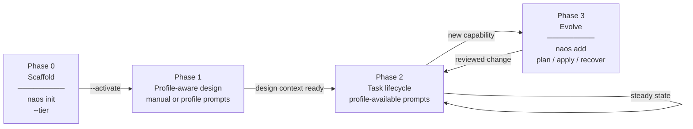

# NAOS Portable Governance Kit — Installation Manual

**Version**: 1.1.0
**Status**: Publication candidate
**Last Updated**: 2026-09-04

---

## Overview

This manual guides you through installing and customising the NAOS Portable Governance Kit in a new project repository. The kit provides a portable, tiered AI coding governance layer through repository files and commands. AI-host discovery and loading differ by client and must be configured and verified in the active host.

Installing NAOS activates a profile and scaffolds governance files. It does not cause every capability to become mature immediately. Capability maturity depends on project readiness, configuration, validator outputs, evidence freshness, gatekeeper status, and human review. See [docs/CONTROL_PLANE.md](docs/CONTROL_PLANE.md) for the capability/policy/evidence model, [docs/AUDIT_PLAYBOOK.md](docs/AUDIT_PLAYBOOK.md) for deterministic audit checks, and [docs/ASSURED_PROFILE_ACTIVATION.md](docs/ASSURED_PROFILE_ACTIVATION.md) before relying on the `assured` profile.

---

## Table of Contents

1. [Prerequisites](#prerequisites)
2. [NAOS Lifecycle Overview](#naos-lifecycle-overview)
3. [Installation via `naos init`](#installation-via-naos-init)
4. [Progressive Enhancement via `naos add`](#progressive-enhancement-via-naos-add)
5. [Minimum Tooling Requirements](#minimum-tooling-requirements)
6. [Manual Installation](#manual-installation)
7. [Naming Conventions](#naming-conventions)
8. [AGENTS.md Porting Checklist](#agentsmd-porting-checklist)
9. [Profile Reference](#profile-reference)
10. [Claude Code Hooks (Enhancement Layer)](#claude-code-hooks-enhancement-layer)
11. [Codex Plugin Adapter (Optional)](#codex-plugin-adapter-optional)
12. [Claude Code Plugin Adapter (Optional)](#claude-code-plugin-adapter-optional)
13. [Customisation Reference](#customisation-reference)

---

## NAOS Lifecycle Overview

NAOS uses four phases, but the installed interaction surface depends on the
selected profile. You run `naos init` once. Quickstart uses manual project
context and review with no prompt lifecycle; Lite installs `/naos-design` and
its bounded task prompts; Standard and Assured also install `/naos-specify`
and the full session/cadence catalogue. `naos add` evolves the kit explicitly
as the project grows.



| Phase | Purpose | Key Tool | Once or Repeated |
| ------- | --------- | ---------- | ------------------ |
| 0 — Scaffold | Install governance files | `naos init` | Once per project |
| 1 — Design | Establish project/spec context | Quickstart: manual; Lite: `/naos-design`; Standard/Assured: `/naos-design` and `/naos-specify` | Once; revisit on scope change |
| 2 — Task Lifecycle | Profile-available delivery workflow | Lite: `/naos-task-start`, `@naos-plan`; Standard/Assured add `/naos-d-start` and `/naos-d-end`; Quickstart has no prompt lifecycle | Every task |
| 3 — Evolve | Add new governance artifacts | `naos add` | As needed |

> See [NAOS_CATALOG.md](./NAOS_CATALOG.md) for the complete catalog of all prompts, agents,
> skills, and CLI commands with phase-by-phase usage guidance.

---

## Prerequisites

| Requirement | Notes |
| ------------- | ------- |
| Git repository | Kit is repo-scoped |
| Python ≥ 3.11 | For `naos init` and governance scripts |
| (Optional) Engram MCP server | Local memory provider pattern for authorized `mem_context`, `mem_search`, `mem_save`, compact recovery, and memory-based hooks |
| (Optional) Claude Code | Can use optional hook templates; not required for NAOS core |

> **Platform boundary:** Portable preview generation is exercised on Linux with
> Python 3.11. Managed `--activate` mutation is currently supported only on
> Darwin ARM64 with CPython 3.11–3.13; Linux, Windows, and other unsupported
> tuples refuse before target mutation. Use an absent `--preview-dir` to inspect
> the complete install set on an unsupported host, then activate on a supported
> host.

---

## Installation via `naos-governance init`

The recommended installation method is `naos-governance init`, which detects your project structure and scaffolds the selected profile:

```bash
# Detection mode — prompts for or uses the selected profile
naos-governance init .

# Greenfield mode — scaffold mandatory specs for a new project
naos-governance init --new

# Explicit profile selection
naos-governance init . --tier standard
```

> **Greenfield mode** (`--new`): Lite, Standard, and Assured scaffold their
> selected spec files with `[FILL:]` / `[ADAPT:]` markers and an empty signal
> set. Lite and above can then use the installed `/naos-design` prompt.
> Quickstart intentionally scaffolds no spec pack and installs no prompts; keep
> its project context manually. See [Minimum Tooling Requirements](#minimum-tooling-requirements)
> if you are not using an AI coding assistant.

`naos init` does the following:

1. Analyses the project (language, frameworks, existing governance files)
2. Uses your explicit profile tier, or prompts you to choose one
3. Copies the selected profile's prevalidated derived `.ai/RULES.md` to your repository
4. Scaffolds the instruction triple (`CLAUDE.md`, `.github/copilot-instructions.md`, `.github/project-context.md`)
5. Writes the optional git-hook file (`.githooks/pre-commit`) without changing
   `core.hooksPath` or activating the hook
6. Writes AI policy config with no secrets; choose disabled, static-only, local Ollama, API-provider, or IDE-agent mode
7. Records memory onboarding state in `configs/naos_memory.yaml` and recommends Engram setup without silently installing anything

`naos init --dry-run` uses a unique preview outside the target and removes it
on exit; it cannot be combined with `--preview-dir`. A persistent preview can
be requested without `--dry-run`, but the destination must be absent. Inside
the target, only the direct `TARGET/.naos-preview` path is supported; other
persistent preview paths must be outside the target. The
initializer refuses to delete or replace an existing preview without
provenance. Default activation uses separate external temporary staging and
leaves a persistent review preview untouched; it regenerates from the current
kit and arguments and is not digest-bound to the earlier preview. For a first
installation, the activation plan is then frozen and applied through the
provenance-bound create-only transaction with an exclusive lock, durable journal,
same-filesystem staging, receipt, and restart recovery. Any unproven existing
destination refuses the complete operation; `--force` is a refused legacy
compatibility flag, not replacement authority. On a valid already managed
project, init activation or a profile change is plan-only and routes to the
content-aware upgrade workflow described below.

For kit maintenance, `configs/profile_rules_source.yaml` is the independent
canonical input for the four shipped profile RULES documents. Run
`python3 -B naos_profile_rules.py --check` for a side-effect-free exact-parity check,
or `python3 -B naos_profile_rules.py --write` only after reviewing an intentional
canonical-source change. The initializer keeps the smaller copy path: it copies
the selected derived artifact that CI, direct control-coherence validation, and
kit-applicable self-check have validated against that source.

The canonical source is a kit/package resource; it is not copied into an adopter
project. Existing adopter files are preserved and cause create-only activation
refusal unless they are already exact, provenance-current outputs of the same
managed request. A project may resolve documented ADAPT stubs or otherwise
maintain authorized local instructions without a kit parity check treating
those edits as corruption. Quickstart does not install the normal script suite.
Lite, Standard, and Assured self-checks report the profile-RULES exact check as
`not_applicable` in an adopter layout; the same check is applicable when run in
the kit or installed-package resource root.

The generated project can later produce `naos/evidence/evidence_pack.json` and `naos/reports/dashboard_summary.json` after validators and dashboard generation run. Missing reports are represented as missing or not configured; they are not treated as passing evidence.

Generated projects also receive `naos/capability_state.yaml` as the adopter-local maturity state declaration. This file is not proof by itself. NAOS evaluates maturity readiness and writes `naos/reports/capability_maturity.json`; it does not automatically promote, certify, or approve maturity. Final maturity decisions remain project governance decisions.

Generated projects also receive `naos/module_header_rules.yaml` as the adopter-local source traceability configuration. NAOS evaluates configured Python source headers and writes `naos/reports/module_header_traceability.json`; it reports missing, legacy, stale, or duplicate headers but does not auto-fix code or prove source correctness.

Generated lite, standard, and assured projects also receive `specs/spec_manifest.yaml` and a local source copy of the full canonical spec pack under `naos/spec_templates/spec-kit/specs/`. NAOS evaluates deterministic spec-pack template contract conformance and writes `naos/reports/spec_pack_contract.json`. Run `naos spec-pack-contract --profile <profile>` or `make -f Makefile.naos naos-spec-pack-contract` before interpreting spec-cascade evidence when spec templates or generated spec files change. Default structural mode permits `[ADAPT]` placeholders; explicit filled mode reports unresolved placeholders and should be run before treating specs as ready for planning or coding. The report now separates spec-file and support-file counts so `files_expected` cannot hide that the standard profile means ten canonical spec files plus support files. The report does not prove specification quality, requirements completeness, approval, implementation, complete traceability, certification, or compliance.

To preview or repair missing profile-required spec templates, run `naos spec-pack-materialize . --profile <profile> --dry-run` or `make -f Makefile.naos naos-spec-pack-materialize` to write `naos/reports/spec_pack_materialization.json` when that adopter report path is configured; kit-repository and other no-output runs return stdout evidence only. Remove `--dry-run` only when you intend to copy missing template files; existing regular files are skipped unless `--force` is explicit. The command validates the manifest schema/profile graph/path inventory and the complete selected source/destination plan, then checks a requested report sink for symlinked in-project ancestors, regular single-link leaf type, and basic writability. It does not cross-check `files[].required_profiles` metadata against every profile-list membership. It blocks without changing spec files when a manifest is invalid, a source is missing or unsafe, a report sink is unsafe or unwritable, a destination escapes the project/is a symbolic link/is not a regular file, or the host is outside the executed macOS/POSIX adapter tuple. `--force` does not bypass those checks. Each leaf uses a same-directory temporary before link or replacement. The multi-file operation is sequential and has no rollback, and a runtime filesystem, post-install cleanup, or late report-write failure can occur after the current or earlier files were copied. A target installed before cleanup failure remains counted as copied with a blocking residue finding; a late report failure returns blocked stdout evidence showing the completed copies. This bounded operation does not apply a profile transition. For brownfield adoption, run `naos spec-assembly-worksheet . --profile <profile>` or `make -f Makefile.naos naos-spec-assembly-worksheet` to write `naos/reports/spec_assembly_worksheet.json`, which maps adoption evidence, candidate requirements, and traceability gaps to manifest-declared spec files for human review. These reports do not fill specs, promote candidate requirements, prove applicability, approve requirements, or prove complete traceability.

NAOS also evaluates deterministic spec-cascade coherence across requirements, task registry entries, source headers, and configured source roots. Run `naos spec-cascade --profile <profile>` or `make -f Makefile.naos naos-spec-cascade` to write `naos/reports/spec_cascade_coherence.json`. The report flags structural findings such as orphan headers, stale status links, uncovered requirements, overloaded FRs, and untraced source; it does not prove complete traceability, code correctness, runtime behavior, approval, certification, or compliance.

Generated projects also receive `naos/ac_completion_evidence.yaml` as an empty explicit manifest for declared AC/SCEN completion evidence. Run `naos ac-completion-evidence --profile <profile>` or `make -f Makefile.naos naos-ac-completion-evidence` to write `naos/reports/ac_completion_evidence.json` once completion claims are declared. Missing or empty manifests are non-blocking and not completion proof. The report checks declared evidence paths and outcomes; it does not prove AC correctness, complete test coverage, implementation correctness, approval, hallucination prevention, certification, or compliance.

Generated projects also receive `naos/control_plane_review_rules.yaml` and `naos/control_plane_review_items.yaml`. Add structured items when governance-surface changes or actionable research/autoresearch findings need routing, then run `naos control-plane-review` to write `naos/reports/control_plane_review.json`. The report is routing evidence; it does not prove research completeness, governance correctness, or compliance.

Generated projects also receive `naos/setup_module_catalog.yaml`. Run `naos setup-recommendations` to write `naos/reports/setup_recommendations.json`, which explains module choices with rationale, benefits, warnings, consequences, prerequisites, evidence outputs, commands, human-review boundaries, and deterministic profile guidance. The report is guidance and orientation; it can recommend staying on the selected profile or considering lite/standard/assured, but it does not automatically upgrade, enable modules, approve maturity, certify outcomes, prove compliance, or guarantee readiness.

Run `naos governance-bypass-posture --profile <profile>` or `make -f Makefile.naos naos-governance-bypass-posture` to write `naos/reports/governance_bypass_posture.json`. The report summarizes local hook configuration, generated pre-commit hook presence, NAOS CI workflow indicators, recent commit-message bypass markers, and tier/profile mismatch. It is posture evidence only: it does not prevent bypasses, prove CI ran, approve PRs, authenticate/authorize operators, certify controls, or prove compliance.

Run `naos external-evidence-ingest --source <scan.sarif> --profile <profile>` or `make -f Makefile.naos naos-external-evidence-ingest EXTERNAL_EVIDENCE_SOURCE=<scan.sarif>` to write `naos/reports/external_evidence_ingest.json`. This parses local SARIF 2.1.0 files and summarizes tool metadata, result counts, levels, rules, and affected paths. Imported findings are unverified external review evidence; NAOS does not run scanners, verify findings, approve remediation, attest evidence, certify controls, or prove compliance.

Generated projects also receive memory posture rules:

- `naos/memory_context_rules.yaml`
- `naos/memory_authorization_matrix.yaml`
- `naos/memory_provider_access_rules.yaml`
- `naos/memory_use_policy_rules.yaml`
- `naos/memory_review_items.yaml`

Use the memory commands by review question:

| Command | Report | Reads payloads or writes memory? |
| --- | --- | --- |
| `naos memory-readiness` | `naos/reports/memory_context_readiness.json` | No |
| `naos memory-access` | `naos/reports/memory_provider_access.json` | No |
| `naos memory-use-policy` | `naos/reports/memory_use_policy.json` | No |

Memory remains advisory recall only. Repository evidence and current user
instructions remain authoritative. Instruction-grade memory requires explicit
approval, provenance, scope, reviewer, timestamp, and freshness. Durable writes
require configured, authorized, verified, and memory-use-policy-permitted access
plus human review. CI has no memory access by default, cloud memory is not
enabled by default, and NAOS does not prevent hallucinations or treat memory as
evidence or approval.

Generated projects also receive `naos/task_context_pack_rules.yaml`. For a specific exact active or completed task, run `naos task-context --task <TASK-ID> --profile <profile>` and select `--recovery-mode active|completed|auto` where needed. `naos task-lifecycle --task <TASK-ID>` inspects the same canonical lifecycle identity. Add `--write-markdown` when you want the derived `naos/context_packs/<TASK-ID>.md` handoff pack. Task packs are bounded, non-authoritative context aids: repository evidence and current user instructions remain authoritative, memory references are advisory only, CI has no memory access by default, and NAOS does not inject context automatically or prevent hallucinations.

Lite, standard, and assured projects also receive the native completion,
research-record, composed-traceability, completed-history, and attributable
human-decision surfaces. `naos task-complete` accepts only an active or
implementation-complete task and preserves exact identity, acceptance criteria,
references, risks, provenance, and the prior card digest. It records repository
state; it does not approve merge/release or admit evidence. Research records
remain candidate-only, composed links remain structural, and agent review can
only report readiness for a separate named-human decision.

Lite, standard, and assured generated projects also receive
`naos/lane_handoffs/_TEMPLATE.yaml` as an optional input template for declared
parallel lanes. Use task cards and `naos/PRE_IMPLEMENTATION_ALIGNMENT.md` first
to record `parallel_lane_opportunity` and `parallel_lane_decision`. Suggested
values such as `parallel_possible` or `parallel_recommended` do not activate
handoff. Lite does not install `scripts/naos_parallel_lane_handoff.py`; review
its filled template manually. Standard and Assured may pass an explicit
`parallel_lane_decision: declared` plus a filled handoff file with
`parallel_lanes_declared: true` to
`python scripts/naos_parallel_lane_handoff.py --profile <profile> --handoff naos/lane_handoffs/<lane>.yaml`.
For those profiles, the generated report under
`naos/reports/parallel_lane_handoff/` is local review evidence consumed by
`naos control-plane-review`; it does not run tests, dispatch agents, create
worktrees or branches, approve work, merge, release, certify, attest, or prove
compliance.

The pre-onboarding `naos repository-intelligence` lifecycle is separate from
the generated project commands below. It establishes a source-bound SQLite/FTS
generation before brownfield activation and may add optional NetworkX/GraphML
only when executed eligibility supports it. Its operational script and schemas
remain in the installed NAOS package or kit checkout instead of adding 22 files
to every generated profile; the activated generation remains project-local.
The following local context and
graph-context surfaces remain advisory project aids; they do not establish that
pre-onboarding provenance.

Generated projects also receive local context and session rules:

- `naos/local_context_index_rules.yaml`
- `naos/semantic_candidate_layer_rules.yaml`
- `naos/graph_context_rules.yaml`
- `naos/session_lifecycle_rules.yaml`

| Command | Output | Boundary |
| --- | --- | --- |
| `naos context-index --profile <profile>` | `naos/reports/local_context_index.json`, plus generated `naos/context_index/local_context_index.sqlite` | Generated local SQLite/FTS candidate index only. |
| `naos context-query --query "<keywords>" --profile <profile>` | `naos/reports/local_context_query.json` | Bounded candidate references from the generated index. |
| `naos semantic-candidates --profile <profile>` | `naos/reports/semantic_candidate_layer.json` | Readiness posture for future semantic/vector candidates only. |
| `naos graph-context --profile <profile>` | `naos/reports/graph_context_readiness.json` | Future explicit-link traversal guardrails only. |
| `naos graph-query --task <TASK-ID> --profile <profile>` | `naos/reports/graph_context_query.json` | Bounded relationship candidates from explicit indexed/report links. |
| `naos session-start`, `naos session-checkpoint`, `naos session-end` | `naos/reports/session_lifecycle.json` | Bounded lifecycle checklist only. |

These reports are generated, cache-like or checklist-like, and not
authoritative. They do not use sqlite-vec, embeddings, NetworkX, GraphML, graph
databases, graph algorithms, global graph scans, Engram, MCP, private memory
payloads, SQLite extension loading, automatic context injection, memory
write-back, or answer generation.

Generated projects also receive `naos/evidence_attestation_rules.yaml` and
`naos/evidence_review_attestations.yaml`.

| Command | Report | Review purpose |
| --- | --- | --- |
| `naos evidence-attestation` | `naos/reports/evidence_attestation.json` | Local SHA-256 digest coverage, reviewer metadata, gaps, waivers, and limitations. |
| `naos evidence-conflicts --profile <profile>` | `naos/reports/evidence_conflict_detection.json` | Conflicting outcomes, stale attestations, duplicate attestations, missing reviewer/operator metadata, and unrouted conflicts. |

This is bounded evidence only. It is not cryptographic signing, signature
verification, tamper-proof storage, conflict resolution, adjudication,
legal/regulatory approval, compliance approval, authorization-backed task
locking, separation-of-duties proof, or guaranteed integrity. Someone with
repository write access can still edit evidence, reports, reviewer metadata, or
manifests unless external controls such as protected branches, signed commits,
external notarization, or independent archival are used.

Generated projects also receive `naos/task_claims.yaml`. Run `naos task-claim --task <TASK-ID> --profile <profile>` or `make -f Makefile.naos naos-task-claim TASK=T-123` to record local claim coordination, `naos task-release --task <TASK-ID>` or `make -f Makefile.naos naos-task-release TASK=T-123` to release the coordination claim, and `naos task-claims --profile <profile>` or `make -f Makefile.naos naos-task-claims` to write `naos/reports/task_claim_report.json`. Task claims are coordination metadata only: they do not authorize work, approve tasks, prove ownership or separation of duties, mark completion, create exclusive access, resolve evidence conflicts, or prove compliance. Conflicting or stale claims require human review.

Run `naos sarif-export --profile <profile>` after structured NAOS reports exist to write `naos/reports/naos_findings.sarif` and `naos/reports/sarif_export.json`. The generated adopter Make form is `make -f Makefile.naos naos-sarif-export`. SARIF export is for code-scanning/security-tool interoperability only: deterministic findings are exported by default, advisory findings require explicit inclusion, and SARIF does not approve work, certify outcomes, attest evidence, prove compliance, promote maturity, or replace repository evidence.

Generated projects also receive `naos/policy_overrides.d/README.md` and
`naos/team_operator_map.yaml` as safe placeholders for adopter-local static YAML
overlays.

Run `naos policy-overrides --profile <profile> --dry-run` or
`make -f Makefile.naos naos-policy-overrides` before relying on overlays.
Static YAML overlays can adapt allowed thresholds, paths, visibility, local
workflow metadata, and optional team/operator configuration scopes.

Policy overlays are bounded:

- Executable adopter plugin runtime remains deferred.
- Repo-versioned plugin sources are optional operator adapters over
  project-local NAOS artifacts, not policy overrides or source authority.
- Team/operator overlays are not authentication, authorization, access control,
  identity proof, separation-of-duties satisfaction, or team-specific gatekeeper
  severity.
- Overrides cannot weaken `ADR-0010: Control-Plane Advisory Boundaries` or
  enable memory write-back, MCP/Engram runtime, sqlite-vec, graph runtime,
  LLMGrader runtime, cloud memory, provider credentials, signing, or advisory
  findings as authority.

Generated projects also receive `naos/agent_trace_events.yaml` as an empty placeholder for manually declared agent trace records. Run `naos agent-traces --profile <profile>` or `make -f Makefile.naos naos-agent-traces` to write `naos/reports/agent_trace_validation.json`. Standard and assured projects can add concise optional `action_receipt` metadata inside a trace event when an action involved side effects, approval posture, memory trust, or claim-to-evidence review. Trace events and action receipts are records for StaticGrader and future audit flows; they are not proof, approval, memory writes, runtime capture, permission enforcement, tool-call interception, legal/compliance/regulatory assurance, hallucination prevention, or behavioral safety evidence, and they must not contain secrets or private payloads.

When a repo-local JSONL/NDJSON harness export exists, run `naos harness-trace-import --source <repo-local.jsonl> --profile <profile>` or `make -f Makefile.naos naos-harness-trace-import HARNESS_TRACE_SOURCE=<repo-local.jsonl>` to write `naos/reports/harness_trace_import.json`. Default mode is report-only; explicit `--write-events` appends valid declared records to `naos/agent_trace_events.yaml` for later validation. The importer does not execute harnesses, capture runtime events, activate hooks, call providers/APIs, use the network, write memory, approve work, certify outcomes, or prove behavior.

Run `naos static-grader --profile <profile>` or `make -f Makefile.naos naos-static-grader` to write `naos/reports/static_grader_report.json`. StaticGrader evaluates deterministic structure only: trace schema conformance, source/evidence references, task/spec/capability linkage, forbidden-payload absence, non-claim boundaries, residual risks, and zero-cost posture. It does not run LLMGrader, call models/APIs/providers, execute trace commands, read/write memory, call Engram/MCP, or evaluate semantic behavior, safety, fairness, robustness, explainability, accountability, legal/regulatory posture, or hallucination risk.

Run `naos ai-surface-budget --profile <profile>` or
`make -f Makefile.naos naos-ai-surface-budget` to write
`naos/reports/ai_surface_context_budget.json`.

The report measures static AI/governance instruction-surface health across
profile/generated `.ai/RULES.md`, prompts, agents, skills, instructions,
workflows, manuals, quick references, and configured governance documents. It
checks standalone and combined context pressure, required anchors, and optional
approved-baseline drift.

StaticGrader, grader assessment, gate status, evidence pack, and dashboard can
consume the report. Autoresearch results do not automatically tune thresholds or
update the baseline. Baseline changes require explicit human/project review.
When posture is `warning` or `degraded`, standard/assured adopters can use the
`ai-surface-health-review` skill to slim always-loaded surfaces while preserving
anchors and routing residual risk.

Run `naos duplicate-function-hygiene`, `naos secret-hygiene`, `naos test-quality-hygiene`, `naos dependency-integrity`, `naos package-reality`, `naos api-symbol-reality`, and `naos pr-risk-classify` to write deterministic local hygiene and PR-risk reports under `naos/reports/`. Generated projects receive adopter-local rules files; lite and higher receive the matching schema/script bundle. These checks detect normalized duplicate Python function bodies, obvious secret-like local findings, weak assertion evidence, undeclared/unresolved Python imports, package reality from local manifests, lock-style pins, configured local CycloneDX SBOM/provenance/hash evidence, explicitly declared Python API symbols from local source inspection, protected-path/workflow/dependency/AI-surface changes, prompt-injection-like text, and secret-like added lines without model, provider, sandbox, target import, or runtime execution. Package registry metadata checks are off by default and require explicit `--registry-mode online --allow-network`. They are review evidence only; they are not PR approval, not security proof, and do not prove semantic correctness, secret-free code, behavioral correctness, API behavior, package safety, vulnerability absence, SBOM completeness, provenance authenticity, supply-chain assurance, approval, certification, compliance, or runtime safety.

Run `naos grader-assessment --mode audit --profile <profile>` or `make -f Makefile.naos naos-grader-assessment MODE=audit` after StaticGrader to write `naos/reports/grader_assessment.json`. Audit mode is deterministic review input, drift mode compares deterministic reports without semantic drift inference, and assess mode summarizes posture rather than certification. The command is zero cost by default, has no LLMGrader runtime, calls no model/API/provider, and does not create behavioral compliance determination, approval, attestation, or maturity promotion.

Run `naos model-policy --profile <profile>` or `make -f Makefile.naos naos-model-policy` to write `naos/reports/model_provider_policy.json`. This reviews local declarations in `naos/model_provider_policy.yaml`, optional `naos_model_role` frontmatter, and future-readiness references for model roles, provider kind, alias posture, obvious literal secret-like values, data-exposure posture, and disabled runtime posture. It does not call providers, start local models, validate credentials, recommend models, maintain provider catalogs, route runtime calls, approve work, certify controls, prove compliance, or activate LLMGrader/autoresearch/semantic behavior.

The agent sponsor registry is not installed by any default profile. Standard and
Assured adopters that have an owner-reviewed need for per-agent build-time
sponsor declarations can preview and explicitly confirm it:

```bash
naos add setup-module agent_sponsor_registry --profile standard --dry-run
naos add setup-module agent_sponsor_registry --profile standard --confirm
naos agent-sponsor-registry --profile standard
naos control-plane-review --profile standard
```

The empty seed assigns nobody and will route all current agents until one
reviewed record exists per normalized `CAP-A-*` id. Use only opaque
project-local references and never store names, email addresses, tokens, keys,
certificates, endpoints, or credential values. The report checks declaration
coverage and registry-review expiry; it does not verify identity, credentials,
credential lifetime, authentication, authorization, or runtime behavior.
Only two safely absent registry/report leaves are not applicable. Directories,
broken symbolic links, symbolic-link ancestors, traversal-bearing or
out-of-root paths, malformed timestamps, future generation timestamps, and
content mismatches route to G2/G6 review. The local digest detects change but
does not authenticate the report or its timestamp.

The AIVSS arithmetic verifier is also absent from every default profile.
Standard and Assured adopters may install it only after reviewing the local
decision to use assessor-supplied AIVSS-Agentic v0.8 arithmetic:

```bash
naos add setup-module aivss_arithmetic_verification --profile standard --dry-run
naos add setup-module aivss_arithmetic_verification --profile standard --confirm
naos aivss-verify --profile standard
naos control-plane-review --profile standard
```

The module uses the published v0.8 PDF pinned by URL and SHA-256, exact Decimal
intermediates, and final round-half-up. High/Critical score prompts and separate
arithmetic/integrity prompts are advisory G2/G6 review input only. Installation
does not calculate CVSS, validate assessor judgement, discover vulnerabilities,
assess risk, prove security or compliance, or grant approval, blocking,
priority, merge, release, risk-acceptance, or publication authority.

Run `naos opencode-config-hygiene --profile <profile>` or `make -f Makefile.naos naos-opencode-config-hygiene` only when a project explicitly has repo-local OpenCode surfaces to review. It writes `naos/reports/opencode_config_hygiene.json` from local declarations and existing project files. It does not create, install, run, or configure OpenCode; inspect global user config; activate MCP or memory; call providers/models; validate credentials; create plugins; mutate tools; approve work; certify controls; or prove compliance.

Run `naos llm-grader-readiness --profile <profile>` or `make -f Makefile.naos naos-llm-grader-readiness` to write `naos/reports/llm_grader_readiness.json`. This is readiness-only governance posture: runtime is disabled by default, no provider/model/API dependency or credential handling is enabled, cost is 0.0 by default, StaticGrader remains primary, and future advisory use requires budget controls, data exposure review, bias/drift limitations, residual-risk review, and human approval. It cannot approve, certify, prove compliance, promote maturity, or replace deterministic controls and human review.

Run `naos behavioral-readiness --profile <profile>` or `make -f Makefile.naos naos-behavioral-readiness` to write `naos/reports/behavioral_governance_readiness.json`. This is deterministic readiness and impacter review only: it reads local reports, rules, and optional human-created baseline metadata; it does not create baselines, grade behavior, call models/providers/APIs, infer semantic drift, calculate N-run statistics, approve, certify, prove compliance, publish, authorize releases, or promote maturity.

Run `naos ai-code-provenance --profile <profile>` or `make -f Makefile.naos naos-ai-code-provenance` to write `naos/reports/ai_code_provenance.json` from optional `naos/ai_code_provenance.yaml` declarations, AI artifact reports, and adjacent local evidence. This is review packaging only: it does not provide legal opinions, authorship proof, ownership proof, infringement clearance, proof of copyright compliance, AI-output detection, line-level attribution, signing, approval, certification, publication authority, release authority, or proof of compliance.

Run `naos compliance-posture --profile <profile>` or `make -f Makefile.naos naos-compliance-posture` to write `naos/reports/compliance_posture.json` from optional `naos/compliance_posture.yaml` declarations and adjacent local evidence. This is adopter-declared review packaging only: it does not provide legal advice, legal opinions, regulatory applicability decisions, compliance pass/fail, compliance scores, certification, conformity assessment, audit opinions, operational-resilience execution, model-risk approval, signing, publication authority, release authority, or proof of compliance.

Quickstart stays intentionally low friction. It installs the smallest working governance surface and does not copy the full policy/capability seed set. Lite, standard, and assured projects receive the policy and capability seeds needed to mature the control plane through project-local configuration and evidence.

For lite, standard, and assured projects, the generated `Makefile.naos` includes
control-plane support targets grouped by review need:

- Core evidence: `make -f Makefile.naos naos-self-check`,
  `make -f Makefile.naos naos-evidence-pack`,
  `make -f Makefile.naos naos-dashboard`.
- Control-plane review: `make -f Makefile.naos naos-control-plane-review`,
  `make -f Makefile.naos naos-setup-recommendations`,
  `make -f Makefile.naos naos-governance-bypass-posture`,
  `make -f Makefile.naos naos-external-evidence-ingest EXTERNAL_EVIDENCE_SOURCE=<scan.sarif>`.
- Context and memory: `make -f Makefile.naos naos-memory-readiness`,
  `make -f Makefile.naos naos-memory-access`,
  `make -f Makefile.naos naos-memory-use-policy`,
  `make -f Makefile.naos naos-task-context TASK=<TASK-ID>`,
  `make -f Makefile.naos naos-context-index`,
  `make -f Makefile.naos naos-context-query QUERY="..."`.
- Optional candidate layers: `make -f Makefile.naos naos-semantic-candidates`,
  `make -f Makefile.naos naos-graph-context`,
  `make -f Makefile.naos naos-graph-query TASK=<TASK-ID>`.
- Source, AI-surface, and hygiene review:
  `make -f Makefile.naos naos-module-headers`,
  `make -f Makefile.naos naos-spec-pack-contract`,
  `make -f Makefile.naos naos-spec-pack-materialize`,
  `make -f Makefile.naos naos-spec-assembly-worksheet`,
  `make -f Makefile.naos naos-spec-cascade`,
  `make -f Makefile.naos naos-agent-traces`,
  `make -f Makefile.naos naos-harness-trace-import HARNESS_TRACE_SOURCE=<repo-local.jsonl>`,
  `make -f Makefile.naos naos-ai-surface-budget`,
  `make -f Makefile.naos naos-static-grader`,
  `make -f Makefile.naos naos-duplicate-function-hygiene`,
  `make -f Makefile.naos naos-secret-hygiene`,
  `make -f Makefile.naos naos-test-quality-hygiene`,
  `make -f Makefile.naos naos-dependency-integrity`,
  `make -f Makefile.naos naos-package-reality`,
  `make -f Makefile.naos naos-api-symbol-reality`,
  `make -f Makefile.naos naos-pr-risk-classify`.
- Readiness and handoff review:
  `make -f Makefile.naos naos-grader-assessment MODE=audit`,
  `make -f Makefile.naos naos-model-policy`,
  `make -f Makefile.naos naos-opencode-config-hygiene`,
  `make -f Makefile.naos naos-llm-grader-readiness`,
  `make -f Makefile.naos naos-behavioral-readiness`,
  `make -f Makefile.naos naos-ai-code-provenance`,
  `make -f Makefile.naos naos-compliance-posture`.
- Evidence integrity, coordination, and export:
  `make -f Makefile.naos naos-evidence-attestation`,
  `make -f Makefile.naos naos-evidence-conflicts`,
  `make -f Makefile.naos naos-task-claim TASK=T-123`,
  `make -f Makefile.naos naos-task-release TASK=T-123`,
  `make -f Makefile.naos naos-task-claims`,
  `make -f Makefile.naos naos-sarif-export`,
  `make -f Makefile.naos naos-policy-overrides`.

The installed `naos` CLI exposes thin wrappers for the same review surfaces,
including `naos task-lifecycle`, `naos task-complete`, `naos research-record`,
`naos composed-traceability`, `naos behavioral-readiness`,
`naos ai-code-provenance`, and `naos compliance-posture`. These commands
support the profile-available prompt/agent lifecycle. Quickstart installs no
prompts and only `@naos-research`; Lite installs design/task prompts and
`@naos-plan`, `@naos-implement`, `@naos-review`, and `@naos-research`;
Standard/Assured install the full catalogue. The wrappers do not replace a
prompt or agent that the selected profile actually installs.
Use `make -f Makefile.naos <target>` unless the adopter project intentionally
wires `Makefile.naos` through its own root `Makefile`.

Lite is the first CI-friendly tier. Quickstart remains advisory and does not
install CI by default. Lite, standard, and assured projects receive a public-safe
`naos-control-plane-ci.yml` workflow that runs the deterministic readiness chain
with read-only repository permissions. It surfaces findings for review; it does
not certify maturity, approve waivers, prove compliance, deploy, publish, or
upload artifacts.

Governance-surface changes should be reviewed through the same control plane.
If specs, agents, skills, prompts, instructions, workflows, module headers,
policies, capabilities, gatekeepers, validators, evidence semantics, or
dashboard semantics change, route the finding to the relevant capability,
policy, gate, evidence pack, dashboard, waiver, or next action. If
`specs/04-architecture.md` changes, check linkage to specs 01-03,
`TASK_REGISTRY.yaml`, `TRACEABILITY_MATRIX.md` where present, affected
capabilities, gate/evidence expectations, known gaps, and residual risks.
Run or recommend `naos spec-pack-contract`, `naos spec-pack-materialize --dry-run`,
`naos spec-assembly-worksheet`, and `naos spec-cascade` when specs, profile-required
spec files, task registry entries, module headers, brownfield evidence, or source
traceability changed.
This is a review/routing rule unless an implemented validator or gate enforces it.

> **Security note**: `naos init` makes **no network calls**. Preview generation writes to an absent operator-selected preview directory or to unique external temporary staging; activation destinations under the target are not written until you pass `--activate`. Activation is create-only: an existing unproven destination refuses the complete plan, and `--force` is refused. Before apply, NAOS binds the complete destination topology and source inventory, then uses the managed-content lock, journal, receipt, and recovery path.

### Minimal Smoke Path

After installation, run these advisory checks before relying on evidence outputs:

```bash
python -m naos_governance.cli doctor
naos-governance first-run --profile quickstart --mode greenfield
```

If `naos-governance` is missing but `python -m naos_governance.cli doctor`
reports the package is importable, reinstall NAOS in the active Python
environment. If bare `naos` opens another tool or prints non-NAOS help, stop
and fix PATH or use `naos-governance ...` / `python -m naos_governance.cli ...`
until command resolution is clear.

`first-run` performs doctor, adoption dry-run, setup recommendations,
profile-baseline setup-module dry-run, evidence pack, and dashboard generation.
Review dry-run output before copying optional modules. `validate-all` runs the
validators installed for the selected tier and skips intentionally absent
tier-specific scripts. It may still report review findings that require
adaptation or waiver before the run should be treated as clean. Dry-run
adoption does not install `Makefile.naos`; run installed-project validators only
after NAOS files have been activated or materialized intentionally. Smoke output
is review evidence only; it is not approval, certification, proof of
compliance, secure-code proof, or proof of runtime safety.

Additional advisory checks:

```bash
naos claims --profile quickstart
naos-governance setup-recommendations --profile quickstart
naos memory-readiness --profile quickstart
naos memory-use-policy --profile quickstart
naos task-context --task T-001 --profile quickstart   # when an active task card exists
naos context-index --profile quickstart
naos context-query --query "governance" --profile quickstart
naos semantic-candidates --profile quickstart
naos graph-context --profile quickstart
naos graph-query --task T-001 --profile quickstart       # when indexed links exist
naos evidence-attestation --profile quickstart
naos capability-maturity --profile quickstart
naos systemic-impact --profile quickstart
naos module-headers --profile quickstart
naos spec-pack-contract --profile quickstart
naos spec-pack-materialize . --profile quickstart --dry-run
naos spec-assembly-worksheet . --profile quickstart
naos spec-cascade --profile quickstart
naos control-plane-review --profile quickstart
naos ai-surface-budget --profile quickstart
naos self-check --profile quickstart
naos roadmap-crosswalk --profile quickstart
naos function-index-health --profile quickstart
naos test-evidence-map --profile quickstart
naos test-evidence --profile quickstart
naos ac-completion-evidence --profile quickstart
naos duplicate-function-hygiene --profile quickstart
naos secret-hygiene --profile quickstart
naos test-quality-hygiene --profile quickstart
naos dependency-integrity --profile quickstart
naos package-reality --profile quickstart
naos api-symbol-reality --profile quickstart
naos pr-risk-classify --profile quickstart
naos gate-status --profile quickstart
naos gate-evaluate --profile quickstart
naos evidence-pack --profile quickstart
naos dashboard --profile quickstart --json-output naos/reports/dashboard_summary.json
```

Inside an adopter project, generated outputs use `NAOS_ROOT` paths such as
`naos/reports/` and `naos/evidence/`. The dashboard command writes the canonical
JSON summary to `naos/reports/dashboard_summary.json`; redirecting stdout keeps
first-run terminals readable. Inside the NAOS kit repository, scripts should
not create a root generated-project `naos/` directory by default; use explicit
`--output`, `--json-output`, or temporary paths for source-repo smoke checks.

Deterministic Conformance Review is implemented today through `naos-conformance` / `autoresearch/runner.py --conformance`. Autoresearch Readiness is routing/configuration posture, not automatic web or LLM research. Behavioral Governance Readiness is deterministic baseline-readiness and impacter review; the default kit does not grade AI behavior, produce behavioral scores, create baselines automatically, require provider setup, or require API keys.

---

## Managed Upgrade and Recovery

For a valid already managed project, normal upgrade and `--dry-run` are the
same plan-only operation. Persist the reviewed plan outside the adopter project,
then apply only that exact digest in a separate invocation:

```bash
naos upgrade /path/to/project --tier assured --plan-out /tmp/assured-plan.json
naos upgrade /path/to/project --apply-plan /tmp/assured-plan.json --expect-plan-digest SHA256
naos upgrade /path/to/project --recover
```

Planning does not modify the adopter project. Apply regenerates the exact fixed
sources, revalidates provenance and current state, and replaces only unchanged
`kit_owned_derived` regular files. Adopter-owned, modified, ambiguous, unsafe,
and out-of-scope content is preserved. Managed `naos init --activate` requests
route to planning and cannot bypass the separate apply command; blanket
`--force` is permanently refused.

Mutation is supported only by the executed Darwin regular-file adapter with
same-filesystem staging and ordered atomic leaf replacement. It does not claim
globally atomic multi-file visibility, Windows or Linux mutation support,
ACL/xattr/DACL/ADS preservation, cryptographic reviewer authentication,
hostile-validator isolation, or network denial.

---

## Memory Setup (Recommended: Engram)

NAOS recommends Engram as the local provider pattern for durable session memory, but memory remains optional and advisory. Standard and Assured workflows benefit from authorized memory for cognitive checkpoints, compact recovery, cross-agent handoffs, and cross-project learning; repository evidence and current user instructions remain authoritative.

Recommended path:

```text
Engram provider data in ENGRAM_DATA_DIR (default ~/.engram)
Derived database: <data-dir>/engram.db
```

If you already have Engram installed or configured, start with a read-only check:

```bash
naos memory check
```

If you are setting it up for the first time, preview the recommended configuration before writing anything:

```bash
naos memory explain
naos memory setup --disposition configure-local
naos memory setup --disposition configure-local --write
naos memory check
```

Everything is local by default. NAOS records `replication_profile: local` and does not configure Git memory sync. An `~/engram-memories` checkout, where present, is an optional management toolkit and is not the live database. Do not store credentials, API keys, tokens, connection strings, customer data, regulated data, or PII in memory. Run `naos memory-readiness --profile <profile>` for policy posture, `naos memory-access --profile <profile>` before agents claim memory/MCP access or durable write authority, and `naos memory-use-policy --profile <profile>` before any memory reference is treated as supporting context or instruction-grade.

When one Engram installation serves multiple repositories, use a registry-approved project identity. Dynamic clients should verify `mem_current_project` at session start; fixed workspace adapters may declare `ENGRAM_PROJECT` only when the explicit value agrees with the approved repository mapping. Never derive identity from a folder name or set one process-global project for every workspace.

If you defer or disable memory, NAOS still works in degraded mode using task cards, compact files, git state, repo governance files, and deterministic reports. Warning: `mem_context`, `mem_search`, `mem_save`, and `mem_session_summary` may be unavailable until Engram, MCP access, write authorization, and memory-use policy are configured, authorized, verified, and permitted.

See [docs/ENGRAM_SETUP.md](docs/ENGRAM_SETUP.md) for the full local, optional-toolkit, and project-identity setup guide.

---

## Progressive Enhancement via `naos add`

After the initial `naos init`, use `naos add` to deploy additional governance artifacts
(instructions, agents, specs, skills, and explicit setup modules) one at a time as your project needs them.

```bash
# List all available artifacts not yet deployed in this project
naos add --list

# Add an instruction file
naos add instruction database
naos add instruction graph-database

# Add an agent definition
naos add agent naos-research

# Add a profile-conditional spec file
naos add spec 05

# Add a skill
naos add skill cognitive-checkpoint

# Review and apply explicit setup-module actions
naos add setup-module --list
naos add setup-module read_only_ci_readiness --profile lite --dry-run
naos add setup-module deterministic_conformance_review --profile lite --dry-run

# Preview without writing (dry run)
naos add instruction graph-database --dry-run

# Blanket replacement is deliberately refused
naos add instruction database --force

# An eligible proven kit-owned collision uses an external immutable plan
naos add instruction database --plan-out /tmp/database-plan.json
naos upgrade . --apply-plan /tmp/database-plan.json --expect-plan-digest SHA256
```

For setup modules, dry-run first. `naos add setup-module` reads
`naos/setup_module_catalog.yaml`, explains choice, rationale, benefit, warning,
consequence, and next action, and applies only explicit `install_actions`.
Readiness-only or deferred modules refuse active installation. Quickstart
remains low-noise; CI, deterministic conformance assets, and seed repairs are
explicit choices, not silent defaults.

`naos add` is provenance-bound. It creates genuinely absent file or tree leaves
through the managed transaction and treats exact current leaves from the same
request as already satisfied. An eligible unchanged kit-owned collision can be
written as an external immutable plan and applied only through the central
digest-bound `naos upgrade` command. Adopter-owned or modified files, including
`AGENTS.md` and configuration, are preserved with manual-action findings;
`--force` never bypasses that rule. Every apply uses the same exclusive lock,
same-filesystem staging, durable journal, receipt, rollback, and
restart-recovery path as initial activation. Multi-action setup modules are one
managed transaction. The workflow does not claim globally atomic visibility,
network-filesystem behavior, Windows metadata support, or ACL/xattr
preservation. If an installed package resource carries an installation-specific
group such as `wheel`, NAOS does not treat that GID as adopter-project
ownership. The transaction records the GID of its actual planned source and
creates the managed leaf under the executing user's digest-bound primary group.

`naos add` uses the same template context as `naos init` for template artifacts
— placeholders like `${project_name}` are substituted from the active project's
signals.

---

## Minimum Tooling Requirements

The NAOS kit is designed for file-first portability, but AI-host discovery,
loading, and feature support vary and require client-specific verification.

| Feature | Minimum Tooling | With AI Assistant |
| --------- | ---------------- | ------------------- |
| Governance files (RULES.md, instructions) | Any text editor | AI can consume the guidance; human review remains necessary |
| `naos init` scaffolding | Python ≥ 3.11 | Same |
| `naos add` progressive deployment | Python ≥ 3.11 | Same |
| `/naos-design` spec elicitation | **AI coding assistant required** | Full PM-quality elicitation |
| `/naos-specify` FR/NFR generation | **AI coding assistant required** | Structured requirement IDs |
| `@naos-plan` task breakdown | **AI coding assistant required** | Story cards + WI decomposition |
| Session lifecycle hook templates | Claude Code only | Optional templates; NAOS does not activate or prove host hook behavior |
| Engram memory | Engram MCP server | Cross-session context persistence |

### Working Without an AI Assistant

If you are not using an AI coding assistant (e.g., setting up governance for a team member):

1. Run `naos-governance init --new` with Lite, Standard, or Assured to scaffold that profile's spec files. Quickstart intentionally creates no spec pack.
2. For Lite and above, open each generated spec file — required sections use `[FILL: <description>]` markers.
3. Fill those markers manually using the generated spec files as structured templates; for Quickstart, maintain the applicable project context directly.
4. The generated hook behaves consistently across tools when the adopter activates it. `RULES.md` supplies policy/human-review posture; only installed, configured consumers enforce executable checks.

> **Design intent**: The governance layer (**RULES.md**, instruction files, agent definitions)
> is fully independent of AI tooling. You get value from the structural constraints even
> without AI assistance.

---

## Manual Installation

If you prefer manual installation:

```text
1. Copy profiles/governance-<tier>/.ai/RULES.md → .ai/RULES.md
2. Copy templates/instruction-triple/CLAUDE.md → CLAUDE.md
3. Copy templates/instruction-triple/copilot-instructions.md → .github/copilot-instructions.md
4. Copy templates/instruction-triple/project-context.md → .github/project-context.md
5. Copy templates/rules-chain/.githooks/pre-commit → .githooks/pre-commit
6. Run: chmod +x .githooks/pre-commit && git config core.hooksPath .githooks
```

---

## Naming Conventions

### Agent Names (`@naos-*`)

The NAOS kit uses the `@naos-*` prefix for AI agent roles. The table is a
source-catalogue sample, not a promise that every profile installs each role.
Quickstart installs only `@naos-research`; Lite installs plan, implement,
review, and research; Standard/Assured install all seven catalogue agents.
The prefix is the **canonical portable name** and should be used in new
projects without change.

| Agent | Role | Invocation |
| ------- | ------ | ----------- |
| `@naos-plan` | Planning & task breakdown | `@naos-plan think deeply about...` |
| `@naos-implement` | Code generation & editing | `@naos-implement TASK-123` |
| `@naos-review` | Code and governance-evidence review | `@naos-review the changes in...` |
| `@naos-debug` | Debugging & root-cause analysis | `@naos-debug why is X failing` |
| `@naos-research` | Document & codebase research | `@naos-research how does X work` |

> **Cross-tool boundary**: `@naos-*` is a NAOS naming convention carried as
> portable text. Whether a host recognizes or loads a named-agent file depends
> on that host's configuration; copying the files does not prove discovery.

### Prompt Directory (`/naos-*`)

In the portable kit, prompt files are stored under `.github/prompts/naos-*.md` (GitHub Copilot) or `.cursor/rules/naos-*.md` (Cursor). The portable kit uses `/naos-*` as the standard prefix for all prompt directories. Projects already using the `naos` prefix need no change.

### Project Management Directory (`naos/` or customisable)

The kit uses `naos/` as the project management root directory by default. This path is configurable via the `NAOS_ROOT` environment variable used by governance scripts:

```python
NAOS_ROOT = Path(os.getenv("NAOS_ROOT", "naos"))
```

To use a different directory (e.g., `pm/`, `.project/`, `gov/`), set `NAOS_ROOT` before running any scripts:

```bash
export NAOS_ROOT=pm        # custom project management dir
naos init --naos-root pm . # init with custom root
```

---

## AGENTS.md Porting Checklist

The NAOS kit includes an `AGENTS.md` standard (`.github/agents/AGENTS.md`) that defines the agent roster, model assignments, and handoff protocols. Use this checklist when porting from another system (e.g., Copilot Workspace, Claude Projects, or a pre-NAOS custom setup).

> **Background**: NAOS uses a repository-owned `AGENTS.md` convention for
> portable agent-role guidance. Adoption counts and native host support are not
> asserted here; verify the active host's current instruction-file behavior.

### Before You Start

- [ ] Read your current AI setup (prompt files, system instructions, agent configurations)
- [ ] Identify Which agents/modes exist (review, plan, implement, debug, research…)
- [ ] Note any model assignments (GPT-4, Claude, Gemini Pro, custom…)
- [ ] Note any tool permissions (file access, web search, code execution…)

### Porting Steps

1. **Inventory existing agents**
   - [ ] List all named agents/personas from your current setup
   - [ ] Map each to the nearest NAOS role (`@naos-plan`, `@naos-implement`, etc.)
   - [ ] Identify any custom agents that do not map (they become custom stubs in AGENTS.md)

2. **Map model assignments**
   - [ ] Fill in `model:` for each agent in AGENTS.md
   - [ ] Cross-check against `configs/ai_models.yaml` (or your project's equivalent)
   - [ ] Note which agents use local models vs API-hosted models

3. **Port governance constraints**
   - [ ] Identify which existing rules map to NAOS rules (check `portability_tags.yaml` mapping)
   - [ ] Move project-specific rules to ADAPT stubs in `.ai/RULES.md`
   - [ ] Flag rules that need human customisation with `# ADAPT: <description>`

4. **Port handoff protocols**
   - [ ] Map your existing agent handoff triggers to NAOS trigger format
   - [ ] Verify handoff targets (`to:`) exist in the NAOS agent roster
   - [ ] Preserve advisory `next_action` hints where they clarify the next command or agent target
   - [ ] Document any skipped handoffs with `_skip_reason`

5. **Port skill definitions** (if applicable)
   - [ ] List existing reusable instruction fragments (prompt templates, system prompt snippets)
   - [ ] Place them in `.github/skills/<skill-name>/SKILL.md`
   - [ ] Reference them from relevant agent definitions in AGENTS.md

6. **Validate**
   - [ ] Run `make -f Makefile.naos validate-all` (if installed for the selected profile)
   - [ ] Manually test each agent invocation (one representative task per agent)
   - [ ] Verify that AGENTS.md loads cleanly in your primary AI tool

### Cross-Tool Compatibility Notes

| Tool | Shipped behavior | Additional configuration boundary |
| ------ | ------------------ | ------- |
| GitHub Copilot / VS Code | Custom agent files are installed under `.github/agents/*.agent.md`; `.github/agents/AGENTS.md` remains an index | Confirm current custom-agent discovery in the active client |
| Claude Code | Root `CLAUDE.md` is installed; it does not import `.github/agents/AGENTS.md` | Add an explicit bare `@path` import or other supported configuration if that index should be loaded |
| Cursor | Cursor rule files are installed for Lite+ | Explicitly reference the agent index from active Cursor rules if desired |
| Gemini CLI | No `GEMINI.md` is installed by NAOS | Add supported `GEMINI.md` or `context.fileName` configuration explicitly |
| Codex and other hosts | Agent files remain portable repository context | Confirm the host's supported instruction locations and load behavior |

See the current [Claude Code memory documentation](https://code.claude.com/docs/en/memory#agentsmd)
and [Gemini CLI context-file documentation](https://google-gemini.github.io/gemini-cli/docs/cli/gemini-md.html)
before configuring those hosts.

### Universal Baseline vs Claude Code Enhancement

The NAOS kit has two governance tiers:

| Tier | What It Is | Works In |
| ------ | ----------- | --------- |
| **Portable Baseline** | Pre-commit hook plus repository prompt/instruction files | Git behavior is explicit; AI-host loading is manual or host-dependent |
| **Claude Code Enhancement** | Session lifecycle hooks (`PreCompact`, `PostCompact`, `SessionStart`, etc.) | Claude Code only |

**Your AGENTS.md should document both tiers.** Mark Claude Code-only features with `_claude_code_only: true` in your agent definitions to prevent confusion when using other tools.

Prompt and handoff `next_action` hints are portable text, but a host must first
load the containing file. They remain advisory and are not tool-specific hooks.

---

## Profile Reference

### governance-lite

Minimum viable governance for exploratory or solo projects.

| Metric | Value |
| -------- | ------- |
| Active rules | 9 (RULES-01/02/05/07/10/19/20/24/26) |
| Blocking-posture rules | 3 (01, 02, 10) |
| Advisory rules | 6 |
| AI-surface budget | Measure with `naos ai-surface-budget`; no universal fixed value |

**Best for**: Side projects, prototypes, internal tools, learning projects.

### governance-standard

Production-grade governance for team projects.

| Metric | Value |
| -------- | ------- |
| Active-table rules | 19 |
| Blocking-posture rules | 13 |
| Advisory/conditional rules | 6 |
| AI-surface budget | Measure with `naos ai-surface-budget`; no universal fixed value |

**Best for**: Production services, open-source projects, consulting engagements.

### governance-assured

Evidence-heavy governance profile for teams that need stronger review evidence.

| Metric | Value |
| -------- | ------- |
| Active-table rules | Same 19 as Standard; the Assured document also includes PGR 27–29 headings |
| Blocking-posture rules | All active rules have blocking posture |
| Human sign-off gates | 4 (architecture decisions, new dependencies, drift regression, rule exceptions) |
| AI-surface budget | Measure with `naos ai-surface-budget`; no universal fixed value |

**Best for**: Regulated or enterprise contexts where evidence-backed review, exception approval, and human sign-off are expected. This profile does not prove legal/regulatory compliance by itself.

These profile counts describe configured rule posture, not the number of
installed executable checks. The generated hook contains no licence scanner,
and initialization does not install the optional `license-scan.yml` workflow.

---

## Claude Code Hooks (Enhancement Layer)

The Claude Code integration templates under `templates/integrations/claude-code/` provide optional session lifecycle hook references for Claude Code users. The kit does **not** ship or activate a root `.claude/settings.json` file by default; the universal file-first baseline works without hooks.

> **⚠️ Claude Code-only**: These hooks require Claude Code (claude.ai/code). They are NOT available in GitHub Copilot, Cursor, Gemini CLI, or Codex.

### Hook Summary

| Hook | Trigger | Purpose |
| ------ | --------- | --------- |
| `PreCompact` | Before context compaction | Optional tool-specific checkpoint reminder; NAOS default reports do not write compacts or memory |
| `PostCompact` | After compaction | Optional recovery hint; review compact/task-card/repo evidence before using it |
| `SessionStart` | New session begins | Surface active task context for review; no automatic context injection by default |
| `TaskCompleted` | Todo marked done | Optional governance reminder; no task completion approval or memory write-back by default |
| `Stop` | Session ends | Soft reminder to run/review `naos session-end` and identify manual updates |

### Installing Hook Templates

```bash
# Preview adopter-local hook templates without writing
naos add setup-module claude_code_hooks --profile standard --dry-run

# Copy templates under naos/integrations/ after review
naos add setup-module claude_code_hooks --profile standard
```

The setup module copies templates only. It does not overwrite
`.claude/settings.json`, activate hooks, inject context, write memory, approve
work, push commits, deploy, or create releases. Review the generated template
files and copy them into active tool settings only through your own explicit
project process.

### Fallback Behaviour

If hook scripts are missing or fail, governance falls back to the universal baseline:

```text
PreCompact fails → Developer runs `naos session-checkpoint --task <TASK-ID>` and manually updates the compact/task card if appropriate; durable memory remains disabled unless access is configured, authorized, verified, memory-use-policy-permitted, and human-approved
PostCompact fails → Developer reads naos/active/<TASK-ID>_compact.md manually
SessionStart fails → Developer runs `naos session-start --task <TASK-ID>` or reads CLAUDE.md "ACTIVE TASK — READ FIRST" section
TaskCompleted fails → Developer runs `make -f Makefile.naos gov-refresh`; the pre-commit hook does not run it
Stop fails → No enforcement; rely on CONTRIBUTING.md governance checklist
```

---

## Customisation Reference

### ADAPT Stubs

Throughout `.ai/RULES.md`, you will find sections marked:

```markdown
## Rule XX — Rule Name [ADAPT]

> **ADAPT THIS STUB** — The following rule covers project-specific infrastructure.
> Replace the content below with your project's equivalent paths, schemas, and patterns.
```

These stubs mark **project-specific governance** that the NAOS core cannot pre-fill. Common adaptations:

| ADAPT area | What to fill in |
| ----------- | ---------------- |
| Database schema conventions | Your table schema, naming conventions, multi-tenancy model |
| Architecture boundary rules | Your module structure, forbidden import paths |
| Spec alignment protocol | Your requirements file paths, requirement ID format |
| Event bus / messaging | Your messaging system, schema evolution rules |
| External service SSRF rules | Your allowed external domains/IP ranges |

### Config Path Parameterisation

Commands that support a configurable project-management root read `NAOS_ROOT`
or the corresponding CLI option. Verify the specific command before relying on
path relocation:

```bash
# Default: uses naos/ as the project management directory
python scripts/naos_code_quality_audit.py --generate-index

# Custom: uses pm/ as the project management directory
NAOS_ROOT=pm python scripts/naos_code_quality_audit.py --generate-index
```

### Instruction and AI-Surface Budget

The generated pre-commit hook does not count instruction lines or enforce fixed
400/450-line thresholds. Rule 18's ≤400L value is documented review posture.
For deterministic context-health evidence, run the separate profile-aware
validator; its active thresholds come from the installed budget-rules file:

```bash
naos ai-surface-budget --profile <profile>
```

The resulting report is context-health evidence, not proof that an AI consumed
the right instructions or avoided overload or hallucination.

---

## Professional Adoption Engine

Use `naos adopt` when installation needs a connected adoption record rather than isolated setup commands. It coordinates preflight, intake, local inventories, install planning, challenge reports, brownfield baselines, candidate requirements, traceability gaps, and an install/adoption decision record.

Typical greenfield path:

```bash
naos-governance init /path/to/new-project --new --tier standard --archetype custom --backend static_only --activate
cd /path/to/new-project
naos preflight . --profile standard
naos intake . --answers naos/intake_answers.yaml --profile standard
naos adopt . --mode greenfield --profile standard --no-prompt
```

Typical brownfield path:

```bash
naos repository-intelligence plan . --profile standard --component-mode baseline --output /tmp/naos-ri-enrollment.json
# Review the plan and use its exact plan_sha256 below.
naos repository-intelligence enroll . --profile standard --plan /tmp/naos-ri-enrollment.json --confirm-plan-sha256 PLAN_SHA256 --reviewer-id REVIEWER
naos repository-intelligence plan . --profile standard --component-mode baseline --output /tmp/naos-ri-activation.json
naos repository-intelligence apply . --profile standard --plan /tmp/naos-ri-activation.json --confirm-plan-sha256 PLAN_SHA256 --reviewer-id REVIEWER
naos repository-intelligence validate . --profile standard
naos-governance init . --tier standard --archetype custom --backend static_only --dry-run
naos-governance init . --tier standard --archetype custom --backend static_only --activate
naos existing-resource-inventory . --profile standard
naos ai-artifact-inventory . --profile standard
naos memory-resource-inventory . --profile standard
naos mcp-resource-inventory . --profile standard
naos repo-context-challenge . --mode brownfield --profile standard
naos plan-challenge . --challenge-mode implementation-plan --profile standard
naos decision-probe . --challenge-mode decision --profile standard
naos planning-gate-review . --challenge-mode gate --profile standard
naos brownfield-baseline . --mode brownfield --profile standard
naos requirements-reconstruct . --mode brownfield --profile standard
naos traceability-gap-register . --mode brownfield --profile standard
naos install-decision-record . --profile standard
naos adopt . --mode brownfield --profile standard --no-prompt
```

Review `naos/reports/mcp_resource_inventory.json` before any MCP activation.
The static descriptor review uses `naos/memory_mcp_inventory_rules.yaml` and
fails closed on declaration or policy drift. The shipped Figma rule covers the
exact repo-local remote VS Code workspace declaration subset only and can report
`allowlisted_pending_activation`; it does not configure a client, start the
server, authenticate, verify remote identity or tools, or authorize reads or
writes. Unknown declarations and the Figma desktop endpoint require a separate
risk-owner review.

The baseline generation requires a host SQLite build with FTS5; activation and
query fail closed when it is unavailable. Select `--component-mode graph` only
when an executed relationship model is eligible
and the optional NetworkX dependency is installed; GraphML is then a derived
navigation artifact, not source authority. `sqlite-vec`, embeddings, and
provider calls remain inactive without a separately defined workload.

Standard activation creates the complete initial governance surface, including
specs 01–10, the task registry, dashboard seed, rules, and managed provenance.
It does not turn template content or adoption candidates into project-specific
requirements. A human reviewer must accept, reject, defer, or edit candidates,
fill the specifications and task plan, and then run the generated validators
and the project's native tests. Profile choice and declared L0–L5 maturity
guide that review; neither authorizes activation or approves maturity.

The generated Makefile exposes equivalent wrappers such as `make -f Makefile.naos naos-adopt MODE=brownfield`, `make -f Makefile.naos naos-context-challenge`, `make -f Makefile.naos naos-plan-challenge`, `make -f Makefile.naos naos-decision-probe`, `make -f Makefile.naos naos-planning-gate-review`, and `make -f Makefile.naos naos-install-decision-record`.

Challenge commands create reports and do not edit project files. Candidate FRs
and NFRs remain candidates until a human reviewer promotes, rejects, or defers
them. Candidate NFRs can be suggested from security/privacy docs, tests,
workflows, source indicators, or explicit intake answers, but they do not prove
security, compliance, runtime safety, or requirements completeness. AI artifact
reconciliation records collision details and selected dispositions without
silently overwriting, merging, deleting, quarantining, or creating files.
Memory, Engram, and MCP findings remain advisory unless the adopter separately
configures and authorizes active usage.

---

## Codex Plugin Adapter (Optional)

The NAOS kit repository includes a canonical Codex plugin source at:

```text
plugins/naos-governance/
```

Use the optional adapter setup-module only to copy project-local guidance:

```bash
naos add setup-module codex_plugin_adapter --profile standard --dry-run
naos add setup-module codex_plugin_adapter --profile standard
naos adapter-coherence --profile standard
```

Adapter coherence also reads `naos/adapter_propagation_state.yaml` when present
or the kit seed otherwise. If mapped NAOS skills, instructions, workflows,
agents, docs, or command maps changed without a reviewed propagation record, the
report flags stale or unreviewed plugin guidance instead of silently updating
plugin files.

The setup-module does not install Codex, mutate Codex plugin caches, edit
personal marketplace files, activate hooks, call MCP, write memory, or approve
work. See `docs/CODEX_PLUGIN_AND_MCP.md` for the architecture and phased MCP
boundary.

---

## Claude Code Plugin Adapter (Optional)

The NAOS kit repository includes a canonical Claude Code plugin source at:

```text
plugins/naos-governance-claude-code/
```

The plugin v1 is skills-only. It does not package hooks, MCP servers, agents,
monitors, binaries, LSP configuration, themes, default settings, or provider
configuration.

Use the optional adapter setup-module only to copy project-local guidance:

```bash
naos add setup-module claude_code_plugin_adapter --profile standard --dry-run
naos add setup-module claude_code_plugin_adapter --profile standard
naos adapter-coherence --profile standard
```

Adapter coherence uses the same propagation-state critic for Claude Code plugin
skills and references. It can show that plugin guidance was reviewed against
current NAOS source hashes, but it does not prove the live Claude Code plugin
cache was refreshed.

For local testing from the kit repository, Claude Code can load the canonical
source directly:

```bash
claude --plugin-dir plugins/naos-governance-claude-code
```

The setup-module does not install Claude Code, mutate Claude plugin state, edit
`.claude/settings.json`, activate hooks, call MCP, write memory, or approve
work. See `docs/CODEX_PLUGIN_AND_MCP.md` for the shared adapter architecture.

---

*Generated by NAOS Portable Governance Kit (v1.1.0)*
*For updates, see: <https://github.com/mfraile/naos-governance>*
