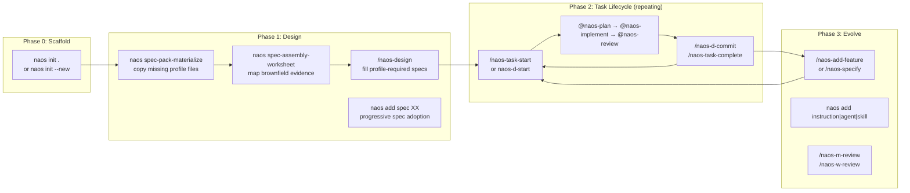

# NAOS Lifecycle Catalog

**Version**: 1.1.0
**Status**: Publication candidate
**Related**: [INSTALLATION_MANUAL.md](./INSTALLATION_MANUAL.md)

The complete catalog of NAOS prompts, agents, skills, and CLI commands — with
their lifecycle phase, purpose, and relationships.

This catalog describes the operating model. The control plane described in
[docs/CONTROL_PLANE.md](./docs/CONTROL_PLANE.md) wraps this model with capability
contracts, profile policy, validators, gatekeepers, evidence-pack export, and
dashboard summaries. It does not rename or replace the prompts, agents, skills,
or command lifecycle below.

**Relationship to the Quick Reference:** the generated-project
`NAOS_QUICK_REFERENCE.md` (under `templates/structural-seeds/naos/`) is the daily,
workflow-first front door — "what should I do for this situation?" — with compact,
linked annexes. This catalog is the complete prompt/agent/skill/CLI inventory and
remains canonical; the quick-reference annexes intentionally show only common items
and point back here.

**Relationship to natural-language routing:** prompts, agents, tutorials, and
the quick reference should route user intent to explicit commands and reports.
They may recommend the next command, but they must not hide execution, rename
commands, cross human-mediated handoffs, or turn evidence into approval.

---

## 1. NAOS Lifecycle Overview

The diagram is the kit-source superset. Quickstart installs no prompts and
only the research agent; Lite installs its bounded design/task prompts and
plan/implement/review/research agents; Standard/Assured install the complete
diagrammed prompt and agent routes. Use only files present in the generated
profile.



**Phase summaries**:

| Phase | What you do | CLI | Profile-available prompts |
| ------- | ------------- | --- | ------- |
| 0 — Scaffold | Install governance structure and memory choice | `naos init`, `naos memory` | — |
| 1 — Design | Fill applicable project/spec context | `naos add spec` | Quickstart: none/manual; Lite+: `/naos-design`; Standard/Assured also `/naos-specify` |
| 2 — Task Lifecycle | Plan → implement → review each task | task/evidence commands | Quickstart: none/manual; Lite: bounded task prompts; Standard/Assured: full session lifecycle |
| 3 — Evolve | Add features, grow the kit | `naos add` | Lite+: `/naos-add-feature`; Standard/Assured also install specify and cadence prompts |

**Control-plane evidence chain**:

```text
prompt / agent / skill / command usage
  -> task cards, specs, spec-pack contract/materialization/assembly worksheet, registry, function index, module headers, spec-cascade traceability
  -> capability contracts and profile policy
  -> validator reports and gatekeeper status
  -> local digest/reviewer metadata where configured
  -> evidence pack and dashboard summary
```

The chain is evidence-mediated and human-reviewed. It is not autonomous runtime orchestration.

`ADR-0010: Control-Plane Advisory Boundaries` defines the advisory-control
contract for this chain: deterministic primary controls run first, advisory
controls may challenge them with candidates or discrepancy findings, residual
risks stay visible, and humans decide durable outcomes. Advisory controls may
not replace deterministic evidence, approve work, certify outcomes, prove compliance, promote
maturity, or prove task completion.

Adapter surfaces such as the Codex and Claude Code plugin sources, Claude Code hooks, Cursor
rules, VS Code/Copilot instructions, and future MCP declarations remain
optional. Use `naos adapter-coherence` after plugin, integration, skill,
instruction, workflow, MCP-posture, or governed-learning propagation changes.
The report is static review evidence; it does not prove live plugin
installation, mutate marketplace files, activate hooks, call MCP, or repair
drift automatically.

---

## 2. Prompt Naming Conventions

| Prefix | Cadence | Examples |
| -------- | ------- | -------- |
| `naos-d-*` | Daily rituals | `naos-d-start`, `naos-d-commit`, `naos-d-end` |
| `naos-w-*` | Weekly rituals | `naos-w-plan`, `naos-w-review` |
| `naos-m-*` | Monthly rituals | `naos-m-review` |
| `naos-t-*` | Triggered (event-driven) | `naos-t-precommit`, `naos-t-test-failure` |
| `naos-task-*` | Task lifecycle | `naos-task-start`, `naos-task-complete` |
| `naos-design` | Phase 1 (once per project) | `naos-design` |
| `naos-specify` | On-demand | `naos-specify` (surgical FR/NFR) |
| `naos-*-start` | Session openers | `naos-d-start`, `naos-task-start`, `naos-ui-design-start` |
| `naos-GOVERNANCE_BOOTSTRAP*` | Meta context | Referenced by selected prompts as context-review guidance |
| `naos-add-feature` | Feature elicitation | `naos-add-feature` |

Workflow prompts may include an advisory `next_action` footer. It tells the human operator the next safe command or agent handoff, but it does not change command names and it does not authorize agents to cross the human-mediated handoff chain.

---

## 3. All Prompts (16)

This is the kit-source superset, not a promise that every generated profile
contains every item. Quickstart installs no prompts; Lite installs its bounded
design/task set; Standard/Assured install the full prompt catalogue. Check the
generated `.github/prompts/` directory and
`naos/profile_generated_surface_contract.json` before invoking a prompt.

### Phase 1 — Design

| Prompt | File | Purpose | When to Use |
| ------ | ---- | ------- | ----------- |
| `/naos-design` | `naos-design.prompt.md` | Elicits full specs (01→10) via PM-quality questions. Cascade or single-spec mode. | After `naos init --new`, before coding. Also for spec revision. |

### Phase 2 — Daily Session (Ritual)

| Prompt | File | Purpose | When to Use |
| ------ | ---- | ------- | ----------- |
| `/naos-d-start` | `naos-d-start.prompt.md` | Morning guidance: requests governance-context and active-card review plus bounded compaction recovery. | Start of every coding session. |
| `/naos-task-start` | `naos-task-start.prompt.md` | Focused task guidance: requests task-card, relevant-spec, function, and scope review. | When beginning a new task (supplement to `/naos-d-start`). |
| `/naos-d-commit` | `naos-d-commit.prompt.md` | Pre-commit checklist: asks for spec-alignment, test-result, and governance-header evidence. | Before `git commit`. |
| `/naos-d-end` | `naos-d-end.prompt.md` | End-of-day wrap: session summary, next steps, memory checkpoint. | End of every coding session. |
| `/naos-task-complete` | `naos-task-complete.prompt.md` | Requests governance review, card/registry updates, conformance commands, and lessons; the prompt itself performs none of them. | When a task is done. |

### Phase 2 — Triggered (Event-Driven)

| Prompt | File | Purpose | When to Use |
| ------ | ---- | ------- | ----------- |
| `/naos-t-precommit` | `naos-t-precommit.prompt.md` | AI-assisted pre-commit review: semantic + structural review beyond linting. | Invoke manually; the shipped Git hook does not invoke AI prompts. |
| `/naos-t-test-failure` | `naos-t-test-failure.prompt.md` | Structured test failure investigation: root cause, blast radius, fix plan. | When CI fails or `pytest` exits non-zero. |

### Phase 3 — Evolution

| Prompt | File | Purpose | When to Use |
| ------ | ---- | ------- | ----------- |
| `/naos-add-feature` | `naos-add-feature.prompt.md` | Feature elicitation + impact assessment: new FR generation, spec update, task estimation. | When a new capability is requested mid-project. |
| `/naos-specify` | `naos-specify.prompt.md` | Surgical FR/NFR generation: one requirement with full AC, user story, collision avoidance. | When adding a single requirement to specs/03-requirements.md. |
| `/naos-ui-design-start` | `naos-ui-design-start.prompt.md` | UI/UX session guidance: requests review of design tokens, component inventory, and applicable UI patterns. | Before frontend/UI work. |
| `/naos-w-plan` | `naos-w-plan.prompt.md` | Weekly sprint planning: prioritise backlog, load velocity metrics, set week goals. | Start of each week (Monday). |
| `/naos-w-review` | `naos-w-review.prompt.md` | Weekly retrospective: what shipped, what blocked, what to carry forward. | End of each week (Friday). |
| `/naos-m-review` | `naos-m-review.prompt.md` | Monthly governance health check: spec drift, conformance gaps, compliance posture. | Monthly (last day of month). |

### Meta / Bootstrap (not invoked directly by users)

| Prompt | File | Purpose | When to Use |
| ------ | ---- | ------- | ----------- |
| `GOVERNANCE_BOOTSTRAP` | `naos-GOVERNANCE_BOOTSTRAP.prompt.md` | Full governance context guidance (verbose). | Referenced by prompts that instruct the operator/host to read it; no automatic load is installed. |
| `GOVERNANCE_BOOTSTRAP-lean` | `naos-GOVERNANCE_BOOTSTRAP-lean.prompt.md` | Compressed governance context guidance. | Referenced by selected prompts; no automatic load is installed. |

---

## 4. Agent Source Catalogue (7)

This table is the kit-source superset. Quickstart installs only
`@naos-research`; Lite installs `@naos-plan`, `@naos-implement`,
`@naos-review`, and `@naos-research`; Standard/Assured install all seven.
Check the generated `.github/agents/` directory before using a named route.

| Agent | File | Purpose | Active During | Handoff Chain |
| ----- | ---- | ------- | ------------- | ------------- |
| `@naos-plan` | `naos-plan.agent.md` | **Task planning**: creates task cards, decomposes FRs into WIs, estimates, checks scope | Phase 2 start | → `@naos-implement` |
| `@naos-implement` | `naos-implement.agent.md` | **Implementation**: writes code, edits files, runs tests | Phase 2 middle | → `@naos-review` |
| `@naos-review` | `naos-review.agent.md` | **Quality review**: checks spec alignment, test coverage, security, governance headers | Phase 2 end | → `@naos-implement` (fixes) or done |
| `@naos-conformance` | `naos-conformance.agent.md` | **Governance review**: reviews documented kit adoption, spec-coverage evidence, and rule posture; reports gaps | On demand (post-PR, monthly) | → escalation if findings require action |
| `@naos-debug` | `naos-debug.agent.md` | **Deep debugging**: no direct edit tools; root-cause analysis, blast-radius evidence, and minimal-fix guidance | When `@naos-implement` is blocked | → `@naos-implement` |
| `@naos-triage` | `naos-triage.agent.md` | **Issue triage**: classifies incoming bugs/requests, routes to correct agent or backlog | On incoming issues | → `@naos-plan` or `@naos-debug` |
| `@naos-research` | `naos-research.agent.md` | **Read-only evidence gathering**: searches code, docs, specs, and constraints before planning | Before unclear/high-risk work | → `@naos-plan` or `@naos-debug` |

Agent files include validated YAML frontmatter. Every `.agent.md` must declare a
`model` and `tools` list so static conformance can audit the generated agent
surface. See [docs/FRONTMATTER_CONFORMANCE.md](./docs/FRONTMATTER_CONFORMANCE.md).

**Standard/Assured task pipeline**:

```text
/naos-task-start → @naos-plan → @naos-implement → @naos-review
                                      ↕ (when blocked)
                               @naos-debug
```

> **Default nested-agent posture**: NAOS-generated default agents do not declare the `agent` or `agent/runSubagent` tools; the handoff chain remains intentionally human-mediated. A separate, optional `@naos-implement-with-debug` agent can be installed only for Standard at capability maturity L2 or Assured at L3 after matching configuration, recorded VS Code host acknowledgement and contract review, named human approval, and deterministic validation. It is instructed to request at most one `@naos-debug` diagnosis and cannot recurse through the shipped child manifest. The child has no direct edit/create or agent-invocation tools, but its terminal/test tools are governed by host approvals and sandboxing rather than a NAOS filesystem boundary. This remains a generated tool-manifest and activation-evidence boundary, not host/runtime enforcement or proof that a child ran. See `templates/agents/AGENTS.md` for the full boundary.
> **Next-action hints**: Prompt footers and `_HANDOFF_TEMPLATE.yaml` may include `next_action` to identify the next safe command or agent target. Treat this as advisory guidance for the human operator, not as runtime orchestration.

---

## 5. All Skills (25)

Skills are invocable context fragments — not agents. They provide focused
guidance without changing the AI's mode. Load via "use the X skill" or
"invoke cookbook-Y skill."

| Skill | Directory | Purpose | Load When... |
| ----- | --------- | ------- | ------------ |
| `cognitive-checkpoint` | `cognitive-checkpoint/` | Prepare a structured WhatWhyWhereGotcha checkpoint for authorized memory write or compact fallback | Every ≥5 consecutive tool calls; at phase transitions |
| `ai-surface-health-review` | `ai-surface-health-review/` | Interpret and remediate AI-surface budget findings without deleting anchors or inflating thresholds | When `naos ai-surface-budget` reports warning/degraded posture or AI surfaces are being slimmed |
| `governed-coding-execution` | `governed-coding-execution/` | Thin orchestrator for evidence-first implementation: bounded context, minimal change, diff review, deterministic evidence, completion-claim ledger, human handoff | Implementing or materially changing code, config, schema, workflow, security, or governance surfaces — and before claiming work is done, fixed, or passing |
| `governed-learning-lifecycle` | `governed-learning-lifecycle/` | Capture, promote, replace, forget, redact, or review lessons without turning candidates into hidden authority | When a lesson may affect future behavior or governed AI surfaces |
| `cookbook-configs` | `cookbook-configs/` | If-then recipes for configuration management | Adding/modifying `configs/*.yaml` |
| `cookbook-evals` | `cookbook-evals/` | AI output quality evals — assertion-based, LLM-as-judge, dataset construction | Building or debugging an AI-backed feature |
| `cookbook-observability` | `cookbook-observability/` | AI session tracing — setup, diagnosis, governance correlation | Agent produces unexpected output; setting up observability for an AI feature |
| `cookbook-docker` | `cookbook-docker/` | Docker + compose + container patterns | Writing Dockerfiles or docker-compose changes |
| `cookbook-frontend` | `cookbook-frontend/` | React/Next.js + Radix UI patterns | Frontend component work |
| `cookbook-governance` | `cookbook-governance/` | NAOS governance update recipes | Updating task cards, TASK_REGISTRY, governance artifacts |
| `cookbook-migrations` | `cookbook-migrations/` | Database migration if-then recipes (Alembic, Flyway, Prisma, Django) | Creating or modifying migrations |
| `cookbook-neo4j` | `cookbook-neo4j/` | Graph database tenant isolation patterns (Neo4j, Neptune, ArangoDB) | Graph DB work |
| `cookbook-python` | `cookbook-python/` | Python code quality and packaging patterns | Python module work |
| `cookbook-tests` | `cookbook-tests/` | Testing patterns — fixtures, markers, direct pytest invocation | Writing or debugging tests |
| `cookbook-ui` | `cookbook-ui/` | UI component patterns (data tables, forms, auth layouts) | UI-heavy implementation sessions |
| `debug` | `debug/` | Systematic debugging protocol: isolate, reproduce, root-cause, verify | Any non-trivial bug investigation |
| `forensic-audit` | `forensic-audit/` | Generic multi-pass forensic audit methodology with deterministic evidence, false-positive hunting, truth matrix, and non-claim boundaries | Deep quality, security, release-readiness, claim-calibration, or governance audits in any project |
| `function-discovery` | `function-discovery/` | Locate and evaluate existing functions before writing new ones | Before creating any new function |
| `gov-refresh` | `gov-refresh/` | Full governance refresh: inventory → specs → headers → RTM → dashboard | After significant code changes |
| `instinct-observer` | `instinct-observer/` | Observe and promote patterns to instincts | When a useful pattern should be canonised |
| `spec-extract` | `spec-extract/` | Extract and cross-reference spec sections by FR/ID | During implementation, to verify requirements |
| `strategic-compact` | `strategic-compact/` | Compact task state for multi-workstream continuity across sessions | Multi-session task tracking |
| `systemic-capability-wiring` | `systemic-capability-wiring/` | Canonical method for wiring features, capabilities, validators, AI surfaces, docs, and configuration into coherent system behavior | Designing, changing, or reviewing any capability, feature, validator, prompt, agent, instruction, workflow, doc, or project configuration |
| `systemic-wiring` | `systemic-wiring/` | Generic cross-project wiring check for modules, APIs, schemas, config, docs, tests, hooks, dependencies, AI-assisted changes, and operational surfaces | Any project change that may leave orphaned artifacts, stale catalogues, or cross-surface contradictions |
| `test-driven-development` | `test-driven-development/` | Acceptance-linked TDD protocol: scenario link, failing test, minimal implementation, refactor, evidence | Implementing behavior tied to FR/NFR/SCEN acceptance evidence |

Skill files include validated YAML frontmatter. Every `SKILL.md` must declare
`parameters` and include a body section such as `## When to Use` or
`## When to Invoke...` so invocation guidance remains visible and auditable.

---

## 6. CLI Commands

### First-install diagnostics and command discovery

```bash
python -m naos_governance.cli doctor      # Diagnose package, Python, PATH, and command resolution
naos doctor                               # Same diagnostic when bare `naos` resolves correctly
naos-governance doctor                    # Collision-resistant console alias
naos first-run --profile standard --mode brownfield
                                          # Same first-contact route when bare `naos` resolves correctly
naos-governance first-run --profile standard --mode brownfield
                                          # One-command safe first-contact route
naos --help                               # Short first-run help
naos commands                             # Full command catalogue
naos help --all                           # Full command catalogue alias
```

**Use `doctor` first**: when installing NAOS in a new shell, venv, Conda
environment, or external adopter project. The diagnostic reports whether bare
`naos` resolves to the installed NAOS CLI or another local command.

### `naos init` — Initial Scaffolding (Phase 0, once)

The shorter `naos` examples below are the canonical command names after
`naos doctor` confirms that bare `naos` resolves to NAOS. For first installs,
video walkthroughs, or shells with command-collision risk, use the
collision-resistant `naos-governance init ...` alias with the same arguments.

```bash
naos init .                              # Detection mode (existing project)
naos init . --tier standard --archetype custom --backend static_only
                                           # Skip tier, archetype, and backend prompts
naos init . --archetype fastapi-generic  # Skip archetype prompt
naos init --new                          # Greenfield mode (new project)
naos init . --activate                   # Managed create-only activation
naos init . --activate --dry-run         # External temporary preview; project unchanged
naos init . --activate --force           # Refused: blanket replacement has no authority
```

**Use `naos init`**: One time, at project start. Generates the governance
structure. Dry-run cannot be combined with `--preview-dir`; a persistent
preview destination must be absent and is never implicitly replaced. Inside
the target, only direct `TARGET/.naos-preview` is supported; other persistent
preview paths must be outside the target. Default
activation uses separate temporary staging, preserves that review preview, and
does not claim digest-bound identity with it. The regenerated set is frozen
into a provenance-bound create-only plan and applied with an exclusive lock,
durable journal, atomic leaf publication, receipt, and restart recovery. Any
unproven existing destination refuses the complete operation.

For an existing repository, first run the `repository-intelligence` lifecycle:

```bash
naos repository-intelligence plan . --profile standard --component-mode baseline --output /tmp/naos-ri-enrollment.json
naos repository-intelligence enroll . --profile standard --plan /tmp/naos-ri-enrollment.json --confirm-plan-sha256 PLAN_SHA256 --reviewer-id REVIEWER
naos repository-intelligence plan . --profile standard --component-mode baseline --output /tmp/naos-ri-activation.json
naos repository-intelligence apply . --profile standard --plan /tmp/naos-ri-activation.json --confirm-plan-sha256 PLAN_SHA256 --reviewer-id REVIEWER
naos repository-intelligence validate . --profile standard
```

The baseline is local SQLite/FTS. NetworkX/GraphML is optional and requires an
eligible executed relationship model; sqlite-vec remains inactive without a
defined workload. Run this lifecycle from the installed NAOS package or kit
checkout; its operational script and schemas are not copied into every default
project scaffold. After validation, preview and separately activate the
initial scaffold, then run `naos adopt` for reports and manually adapt specs
and tasks before claiming project-specific coverage.

### `naos upgrade` — Managed Content-Aware Transition (Phase 3, repeating)

```bash
naos upgrade . --tier assured                                      # Plan only; project unchanged
naos upgrade . --tier assured --dry-run                            # Identical plan-only behavior
naos upgrade . --tier assured --plan-out /tmp/assured-plan.json    # Persist one immutable external plan
naos upgrade . --apply-plan /tmp/assured-plan.json --expect-plan-digest SHA256
naos upgrade . --recover                                           # Recover an interrupted transaction
naos upgrade . --tier assured --force                              # Refused: blanket replacement is unsafe
```

**Use `naos upgrade`** for a valid already managed project. Planning classifies
the complete managed inventory from recorded base/current/new identities and
never mutates the target. Apply is a separate invocation: it reloads the exact
plan, verifies the supplied digest, regenerates its fixed sources, and
revalidates provenance and current state. Only unchanged `kit_owned_derived`
regular files are replaceable; adopter-owned or modified paths are preserved.
Legacy or ambiguous projects remain diagnostic-only. Use `naos init` for the
first installation; managed init transitions route back to this plan-only flow.

### `naos add` — Progressive Enhancement (Phase 3, repeating)

```bash
naos add instruction database            # Add SQL instruction to .github/instructions/
naos add agent naos-debug                # Add debug agent to .github/agents/
naos add spec 05                         # Add optional spec 05-api.md
naos add skill cookbook-neo4j            # Add neo4j skill to .github/skills/
naos add setup-module --list             # Show installable vs deferred setup modules
naos add setup-module read_only_ci_readiness --profile lite --dry-run
naos add setup-module deterministic_conformance_review --profile lite --dry-run
naos add setup-module governed_debug_escalation --profile standard --dry-run
naos add setup-module --recommended --profile assured --dry-run
naos add --list                          # Show available templates not yet deployed
naos add --list instruction              # Show only available instructions
naos add instruction graph-database --dry-run  # Preview without writing
naos add instruction database --plan-out /tmp/database-plan.json  # Persist an eligible collision plan
naos upgrade . --apply-plan /tmp/database-plan.json --expect-plan-digest SHA256
naos add instruction database --force          # Refused: blanket replacement has no authority
```

**Use `naos add`**: When your activated project needs an absent governance
primitive. A genuinely absent single-file addition remains a simple
provenance-bound atomic create. For an eligible unchanged kit-owned collision,
write an external immutable plan and apply it through the central digest-bound
upgrade command. Adopter-owned or modified content is preserved with a manual
action. Readiness-only and deferred modules refuse installation, and legacy
`--force` remains unavailable.

### `naos memory` — Engram Memory Onboarding (Phase 0, then as needed)

```bash
naos memory explain                         # Why memory matters and what is local/private
naos memory check                           # Detect existing Engram/MCP/data-directory declarations
naos memory setup --disposition configure-local        # Preview pending local-provider state
naos memory setup --disposition configure-local --write # Record configs/naos_memory.yaml only
naos memory status                          # Show recorded memory state
naos memory-readiness --profile <profile>   # Evaluate memory/context governance readiness
naos memory-access --profile <profile>      # Evaluate declared/configured posture and explicit unverified fields
naos memory-use-policy --profile <profile>  # Evaluate memory-use policy, review items, recall/audit readiness
naos learning-loop-review --profile <profile> # Review governed learning lifecycle records
naos task-context --task <TASK-ID> --profile <profile>  # Generate bounded task context pack
naos context-index --profile <profile>      # Build generated local context index
naos context-query --query "<keywords>" --profile <profile> # Query bounded index candidates
naos semantic-candidates --profile <profile> # Check future semantic candidate readiness
naos graph-context --profile <profile>      # Check future graph-context readiness
naos graph-query --task <TASK-ID> --profile <profile> # Query bounded explicit-link relationships
naos session-start --task <TASK-ID> --profile <profile> # Generate session-start checklist
naos session-checkpoint --task <TASK-ID> --profile <profile> # Generate checkpoint checklist
naos session-end --task <TASK-ID> --profile <profile> # Generate session-end checklist
naos agent-traces --profile <profile>      # Validate declared agent trace records
naos harness-trace-import --source naos/harness_traces/example.jsonl --profile <profile> # Import local harness traces
naos ai-surface-budget --profile <profile> # Measure AI/governance instruction context health
naos static-grader --profile <profile>     # Run deterministic structural StaticGrader
naos grader-assessment --mode audit --profile <profile> # Build deterministic audit/drift/assess review input
naos ai-component-inventory --profile <profile> # Build declared AI component inventory evidence
naos agent-sponsor-registry --profile <profile> # Validate opt-in build-time sponsor declarations
naos model-policy --profile <profile>      # Review model-provider declarations
naos model-telemetry --profile <profile>   # Review local model telemetry evidence
naos opencode-config-hygiene --profile <profile> # Review optional OpenCode config hygiene
naos design-traceability --profile <profile> # Review optional UI object-identity declarations
naos ui-experience-quality --profile <profile> # Review optional UI experience-quality evidence
naos llm-grader-readiness --profile <profile> # Report readiness-only LLMGrader posture
naos behavioral-readiness --profile <profile> # Report behavioral baseline readiness and impacters
naos ai-code-provenance --profile <profile> # Compose AI-assisted code provenance evidence for review
naos compliance-posture --profile <profile> # Compose adopter-declared compliance posture evidence for review
naos task-claim --task <TASK-ID> --profile <profile> # Record task-claim coordination metadata
naos task-release --task <TASK-ID> --profile <profile> # Release task-claim coordination metadata
naos task-claims --profile <profile>      # Summarize active/released/stale/conflicting claims
naos task-lifecycle --task <TASK-ID> --profile <profile> # Inspect exact active/completed state
naos task-complete --task <TASK-ID> --profile <profile> # Record native completed history
naos research-record naos/research/<record>.yaml --profile <profile> # Validate candidate research
naos composed-traceability --profile <profile> # Compose explicit task/source/test/evidence/decision links
naos sarif-export --profile <profile>    # Export structured NAOS findings to SARIF 2.1.0
naos policy-overrides --profile <profile> --dry-run # Validate static policy overlays
```

**Use `naos memory`**: During installation or whenever you need to verify Engram
availability. If Engram is already installed, start with `naos memory check` and
connect NAOS to that setup instead of creating a duplicate store. The recommended
new setup uses Engram's provider-managed data directory (`ENGRAM_DATA_DIR`, or
`~/.engram` by default) and its derived `engram.db`. NAOS keeps replication local
and does not configure Git memory sync; an `~/engram-memories` checkout is an
optional management toolkit, not the live store. For multi-project use,
`naos memory check` surfaces declared workspace identities and optional resolver
results, but configuration metadata alone does not prove canonical binding or
prevent cross-project misattribution.

Run memory commands before agents rely on memory policy or claim memory/MCP
access:

| Command | Review question |
| --- | --- |
| `naos memory-readiness` | Is memory policy posture declared and recoverable? |
| `naos memory-access` | Is configured provider/MCP metadata distinguishable from verified usable access? |
| `naos memory-use-policy` | Can a memory reference be treated as supporting context or instruction-grade? |

Memory remains advisory recall, not evidence or approval. Recall traces are
usage records, not proof; audit events are records, not approvals.

Run `naos learning-loop-review` before a lesson is treated as active guidance or
used to change skills, prompts, workflows, baselines, gates, maturity, or
instructions. Candidate learning is proposal-only; active learning requires
evidence, scope, review, approval, retrieval policy, and review/expiry metadata.
History records cover superseded, deprecated, archived, rejected, and redacted
lessons.
If memory is deferred or disabled, NAOS uses degraded recovery: task cards,
compact files, git state, repo governance files, and deterministic reports.

### `naos task-context` — Bounded Task Handoff Context

```bash
naos task-context --task T-001 --profile standard
naos task-context --task T-001 --profile standard --write-markdown
```

**Use `naos task-context`** before handing a specific task/story card to Codex,
Claude Code, Cursor, Copilot, Gemini CLI, ChatGPT/OpenAI workflows, or another
AI surface. It writes `naos/reports/task_context_pack.json` and optionally a
derived `naos/context_packs/<TASK-ID>.md` pack. The pack is bounded and
non-authoritative: current user instructions, repo governance files, git state,
and deterministic NAOS reports outrank memory/context references. It includes
traceability posture such as module-header, spec-pack, and spec-cascade evidence where
available. It does not call Engram, MCP, or memory tools; it does not inject
context automatically, approve work, or prevent hallucinations.

### `naos context-index` — Local Context Index

```bash
naos context-index --profile standard
naos context-index --profile standard --no-sqlite
naos context-query --query "governance" --profile standard
naos context-query --path specs/foo.md --profile standard
naos semantic-candidates --profile standard
naos graph-context --profile standard
naos graph-query --task T-001 --profile standard
```

**Use `naos context-index`** when a generated local retrieval substrate would
help future task-context or review workflows find bounded candidates. It writes
`naos/reports/local_context_index.json` and, in generated adopter projects,
`naos/context_index/local_context_index.sqlite` using stdlib `sqlite3`.
FTS is exact/keyword candidate retrieval when available; metadata/path lookup is
the fallback. The index is generated, cache-like, and not authoritative: source
artifacts and deterministic NAOS reports remain the review trail. Group 24 does
not implement sqlite-vec, embeddings, semantic scoring, graph traversal,
NetworkX, GraphML, Engram/MCP calls, private memory payload indexing, or
automatic context injection.

**Use `naos context-query`** after the index exists when you need deterministic
candidate references by keyword, exact path, artifact id, task id, spec ref,
capability id, report status, or metadata filter. It writes
`naos/reports/local_context_query.json`; optional Markdown under
`naos/context_queries/` is derived and non-authoritative. Query results are not
answers and do not replace source artifacts.

**Use `naos semantic-candidates`** to inspect readiness for a future
semantic/vector candidate layer. It writes
`naos/reports/semantic_candidate_layer.json` and is reporting only: no
sqlite-vec runtime, embeddings, extension loading, provider/model/API calls,
cloud embedding, Engram/MCP access, memory payload search, or semantic
candidates as authority.

**Use `naos graph-context`** to inspect readiness for future explicit-link
relationship traversal. It writes `naos/reports/graph_context_readiness.json`
and is reporting only: graph links are relationship candidates, not source of
truth, and no hallucination-prevention guarantee is claimed. NetworkX, GraphML,
graph databases, graph algorithms, PageRank, centrality, community detection,
global graph scans, MCP/FastMCP, Engram calls, memory payload graphing,
sqlite-vec, and embeddings remain deferred/project-configured.

**Use `naos graph-query`** after a local context index exists when you need
bounded relationship candidates by task, artifact, spec, or capability. It
writes `naos/reports/graph_context_query.json`; optional Markdown under
`naos/context_queries/` is derived and non-authoritative. Graph-query results
are not truth, source authority, or implementation proof.

### `naos session-start/checkpoint/end` — Lifecycle Checklists

```bash
naos session-start --task T-001 --profile standard
naos session-checkpoint --task T-001 --profile standard
naos session-end --task T-001 --profile standard
```

**Use lifecycle reports** to coordinate daily work without unsafe automation.
They write `naos/reports/session_lifecycle.json` with task discovery,
task-registry/card/compact posture, read-only git state, report freshness,
context posture, memory posture, recommended commands, routing recommendations,
and proposal-only memory candidates. They do not mutate task cards,
`TASK_REGISTRY`, compact files, git state, or memory; they do not inject context
automatically, approve work, prove completion, or prevent hallucinations.
Memory candidates are `proposal_only` and `not_written`.

### `naos agent-traces` — Agent Trace Event Validation

```bash
naos agent-traces --profile standard
make -f Makefile.naos naos-agent-traces
```

**Use `naos agent-traces`** when manually declared records exist in
`naos/agent_trace_events.yaml`. The command writes
`naos/reports/agent_trace_validation.json` and checks schema shape, source
references, lightweight forbidden-payload patterns, memory-reference posture,
trace-as-authority wording, and optional `action_receipt` metadata. For
standard/assured projects, add `action_receipt` only when a trace needs concise
side-effect, approval, memory-trust, or claim-to-evidence metadata. Trace
events support future StaticGrader, audit, drift, and assessment flows; they
are records, not proof, approval, memory writes, runtime capture, permission
enforcement, tool-call interception, legal/compliance/regulatory assurance,
hallucination prevention, or behavioral safety evidence. The default kit does
not run LLMGrader, execute commands from trace records, call external APIs,
call Engram/MCP/memory tools, or read private memory payloads.

### `naos harness-trace-import` — Local Harness Trace Import

```bash
naos harness-trace-import --source naos/harness_traces/example.jsonl --profile standard
make -f Makefile.naos naos-harness-trace-import HARNESS_TRACE_SOURCE=naos/harness_traces/example.jsonl
```

**Use `naos harness-trace-import`** when a repo-local JSONL/NDJSON harness
export should be normalized into declared NAOS trace-event shape. The default
mode writes `naos/reports/harness_trace_import.json` only; pass
`--write-events` or `HARNESS_TRACE_IMPORT_ARGS=--write-events` to append valid
declared records to `naos/agent_trace_events.yaml` for later
`naos agent-traces` validation. The command does not execute harnesses,
capture runtime events, activate hooks, run commands from trace records, call
providers/APIs, access the network, read memory payloads, write memory, approve
work, certify outcomes, or prove behavior.

### `naos ai-surface-budget` — AI-Surface Context Health

```bash
naos ai-surface-budget --profile standard
make -f Makefile.naos naos-ai-surface-budget
```

**Use `naos ai-surface-budget`** when prompts, agents, skills, instructions,
workflows, manuals, quick references, or governance docs change, and before
aggregate self-check/gate/evidence/dashboard review. The command writes
`naos/reports/ai_surface_context_budget.json` and reports standalone and
combined context pressure, required anchor coverage, family posture, and
optional approved-baseline drift. Required anchors are only present when every
configured phrase is found; partial matches are reported with
`missing_phrases`. It is deterministic and local-file-only: it
does not call models/providers, read or write memory, prevent hallucinations,
grade behavior, auto-tune thresholds, or approve baseline changes.

### `naos static-grader` — Deterministic StaticGrader Report

```bash
naos static-grader --profile standard
make -f Makefile.naos naos-static-grader
```

**Use `naos static-grader`** after trace validation when you want a
deterministic structural grading report at
`naos/reports/static_grader_report.json`. StaticGrader checks trace schema
conformance, source/evidence references, task/spec/capability linkage,
forbidden-payload absence, non-claim boundaries, residual risks, and cost
posture. It costs 0.0 by default and does not call models, APIs, providers,
Engram, MCP, memory tools, or external services. It does not execute commands
from trace records and does not prove behavioral safety, semantic correctness,
runtime behavior, legal/regulatory posture, approval, maturity promotion, or
hallucination prevention. D2/D3/D5/D6/D7/D8-style behavioral dimensions remain
not evaluated/readiness-only in this foundation slice.

### Deterministic hygiene controls

```bash
naos duplicate-function-hygiene --profile standard
naos secret-hygiene --profile standard
naos test-quality-hygiene --profile standard
naos dependency-integrity --profile standard
naos package-reality --profile standard
naos api-symbol-reality --profile standard
naos pr-risk-classify --profile standard
```

**Use these commands** before gate/evidence review when you need local,
deterministic hygiene evidence.

| Command | Report |
| --- | --- |
| `naos duplicate-function-hygiene` | `naos/reports/duplicate_function_hygiene.json` |
| `naos secret-hygiene` | `naos/reports/secret_hygiene.json` |
| `naos test-quality-hygiene` | `naos/reports/test_quality_hygiene.json` |
| `naos dependency-integrity` | `naos/reports/dependency_integrity.json` |
| `naos package-reality` | `naos/reports/package_reality.json` |
| `naos api-symbol-reality` | `naos/reports/api_symbol_reality.json` |
| `naos ac-completion-evidence` | `naos/reports/ac_completion_evidence.json` |
| `naos harness-trace-import` | `naos/reports/harness_trace_import.json` |
| `naos pr-risk-classify` | `naos/reports/pr_risk_classification.json` |

`naos pr-risk-classify` checks local git diff metadata for protected paths,
workflow/dependency changes, AI instruction surfaces, prompt-injection-like
added text, secret-like added lines, and contributor-trust posture from local/CI
metadata.

These commands do not call models, APIs, providers, Engram, MCP, memory tools,
sandboxes, or external security services. `naos package-reality` can consume
configured local CycloneDX SBOM, provenance, and hash evidence; package registry
metadata checks are off by default and require explicit package-reality online
mode with network consent.
They do not prove semantic correctness, secret-free code, behavioral
correctness, API behavior, package safety, vulnerability absence, SBOM
completeness, provenance authenticity, supply-chain assurance, PR approval,
security proof, approval, certification, compliance, or runtime safety.

### `naos grader-assessment` — Deterministic Grader Assessment

```bash
naos grader-assessment --mode audit --profile standard
make -f Makefile.naos naos-grader-assessment MODE=audit
```

**Use `naos grader-assessment`** after StaticGrader when deterministic grading
posture should be packaged for review at `naos/reports/grader_assessment.json`.
Audit mode is deterministic review input, drift mode compares deterministic
reports without semantic drift inference, and assess mode summarizes posture
rather than certification. It remains zero cost by default, has no LLMGrader
runtime, calls no model/API/provider, and does not produce behavioral compliance
determination, approval, attestation, or maturity promotion.

### `naos ai-component-inventory` — Declared AI Component Inventory

```bash
naos ai-component-inventory --profile standard
make -f Makefile.naos naos-ai-component-inventory
```

**Use `naos ai-component-inventory`** before control-plane review in Standard
or Assured adopters. It builds the custom `ai_component_inventory.v1` report
from agent, skill, and instruction frontmatter plus the local model-provider
policy. Repository-relative SHA-256 content digests and canonical semantics
determine freshness; mtimes and wall-clock age do not.

`naos control-plane-review` is the named consumer. Missing, malformed, stale,
content-mismatched, or incomplete required evidence routes to G2/G6 human
review. The report is not CycloneDX/SPDX conformance, runtime discovery,
completeness proof, signing, attestation, provenance authentication,
supply-chain assurance, compliance approval, release, or publication.

### `naos agent-sponsor-registry` — Optional Agent Sponsor Registry

```bash
naos add setup-module agent_sponsor_registry --profile standard --dry-run
naos add setup-module agent_sponsor_registry --profile standard --confirm
naos agent-sponsor-registry --profile standard
make -f Makefile.naos naos-agent-sponsor-registry
```

**Use `naos agent-sponsor-registry`** only after a Standard or Assured project
has explicitly installed the opt-in module and defined its opaque
sponsor-reference and review-expiry policy. The empty seed assigns nobody. The
validator derives current `CAP-A-*` ids from `.agent.md` frontmatter and checks
one declaration per agent, duplicate/orphan records, registry review dates,
categorical external credential posture, secret-like values, input drift, and
report tampering. Only two safely absent registry/report leaves are not
applicable; directories, broken symbolic links, symbolic-link ancestors,
traversal-bearing or out-of-root paths, malformed or future generation
timestamps, and other unsafe artifacts route.

`naos control-plane-review` is the named consumer. Review findings produce one
G2/G6 route; a complete current declaration produces no sponsor-registry route.
Reports hash sponsor references rather than copying them. A passing result is
declaration completeness only—not sponsor identity or approval,
authentication, authorization, delegation, separation of duties, credential
existence or lifetime, runtime identity/enforcement, SPIFFE/SPIRE, OAuth/OBO,
mTLS, signing, attestation, compliance, release, or publication authority.
The local digest binds `generated_at`, but it does not authenticate the report
or independently prove a valid past generation timestamp.

### `naos aivss-verify` — Optional AIVSS-Agentic v0.8 Arithmetic Verification

```bash
naos add setup-module aivss_arithmetic_verification --profile standard --dry-run
naos add setup-module aivss_arithmetic_verification --profile standard --confirm
naos aivss-verify --profile standard
make -f Makefile.naos naos-aivss-verify
```

**Use `naos aivss-verify`** only after a Standard or Assured project explicitly
installs the module and supplies assessor-owned CVSS-v4 base score, all ten
v0.8 factor values, threat maturity, mitigation strength, and evidence refs.
The verifier pins the published v0.8 PDF by URL and SHA-256, preserves exact
finite-decimal intermediates, applies round-half-up only to the final one-decimal
score, and leaves the PDF's 0.0 result unbanded.

High and Critical results create score-review prompts. Arithmetic mismatches or
missing, malformed, stale, unsafe, or content-mismatched installed evidence
create separate integrity-review prompts. Both are fixed advisory G2/G6 input.
The module does not calculate or validate CVSS, select or verify subjective
inputs, assess risk or exploitability, discover vulnerabilities, observe
runtime behavior, prove mitigation or security, approve, block, prioritize,
merge, release, accept risk, certify, attest, publish, or prove compliance.

### `naos model-policy` — Model-Provider Declaration Review

```bash
naos model-policy --profile standard
make -f Makefile.naos naos-model-policy
```

**Use `naos model-policy`** when a project needs a central, repo-local review
of model roles, optional mixed-tool model bindings, provider kind,
alias/latest/preview posture, cost/data exposure, credential
environment-variable names, and disabled-by-default runtime posture. It reads
`naos/model_provider_policy.yaml`, optional `naos_model_role` frontmatter,
optional `tool_model_bindings`, and future-readiness references, then writes
`naos/reports/model_provider_policy.json`.

This command does not call providers, start local models, validate credentials,
recommend models, maintain provider catalogs, rewrite IDE/tool configuration,
route runtime calls, approve work, certify controls, prove compliance, promote
maturity, or activate LLMGrader/autoresearch/semantic behavior.

### `naos model-telemetry` — Model Telemetry Evidence Review

```bash
naos model-telemetry --profile standard
make -f Makefile.naos naos-model-telemetry
```

**Use `naos model-telemetry`** when a project explicitly has local model-use
telemetry summaries to review. It reads `naos/model_telemetry_evidence.yaml`
and declared local YAML, JSON, or JSONL telemetry files, then writes
`naos/reports/model_telemetry_evidence.json`. It checks session/task/model-role
links, model-provider policy refs, route class, data class, cost and latency
thresholds, stale records, policy exceptions, and prompt/response or
credential field presence.

This command does not call providers, models, APIs, gateways, MCP, memory
tools, local servers, networks, hooks, or IDE settings. It does not validate
credentials, start gateways, route runtime calls, inspect payload semantics,
prove complete costs, prove route correctness, approve work, certify controls,
prove compliance, or activate model/provider runtime behavior.

### `naos opencode-config-hygiene` — OpenCode Config Hygiene Review

```bash
naos opencode-config-hygiene --profile standard
make -f Makefile.naos naos-opencode-config-hygiene
```

**Use `naos opencode-config-hygiene`** only when a project explicitly has
repo-local OpenCode surfaces to review. It reads
`naos/opencode_config_hygiene.yaml`, project `AGENTS.md`, project
`opencode.json` or `opencode.jsonc`, optional `.opencode/` subdirectories, and
`naos/reports/model_provider_policy.json` when present. It writes
`naos/reports/opencode_config_hygiene.json` and can route findings through
`naos control-plane-review`.

This command does not create, install, run, or configure OpenCode; inspect
global user config; activate MCP or memory; call providers, models, APIs, or
networks; validate credentials; create plugins; mutate IDE/tool settings;
approve work; certify controls; prove compliance; prevent prompt injection;
prove malware absence; or prove supply-chain safety.

### `naos design-traceability` — UI Spec-Object Traceability Review

```bash
naos design-traceability --profile standard
make -f Makefile.naos naos-design-traceability
```

**Use `naos design-traceability`** when a project wants optional, repo-local
screen/component object IDs that connect UI specs to FR/NFR/task refs, local
screen specs, implementation paths, changed-file evidence, test/check
evidence, optional design references, residual risks, and human-review
posture. It reads `naos/design_traceability.yaml` and writes
`naos/reports/design_traceability.json`. `naos control-plane-review` can route
findings from that report for human review.

This command does not call or inspect Figma, MCP, html.to.design, browsers,
providers, models, memory tools, APIs, networks, hooks, or IDE settings. It
does not synchronize code/design, mutate design tools, prove design quality,
accessibility, privacy, brand posture, implementation correctness, approval,
certification, attestation, release readiness, or compliance.

### `naos ui-experience-quality` — UI Experience Quality Evidence Review

```bash
naos ui-experience-quality --profile standard
make -f Makefile.naos naos-ui-experience-quality
```

**Use `naos ui-experience-quality`** when a project explicitly enables optional
stage-aware UI quality evidence review for screens/components. It reads
`naos/ui_experience_quality.yaml` and writes
`naos/reports/ui_experience_quality.json`, checking declared links to
FR/NFR/task/AC refs, data/API/state refs, token and typography/spacing refs,
screenshot/state evidence refs, accessibility/performance refs, generator or
AI-critique provenance, and human design-review posture. `naos
control-plane-review` can route findings from that report for human review.

This command does not call or inspect Figma, MCP, Penpot, html.to.design,
browsers, screenshot tools, providers, models, memory tools, APIs, networks,
hooks, or IDE settings. It does not generate screenshots, run accessibility or
performance tools, mutate design tools, score or prove design quality, approve
UI, certify accessibility, prove privacy or brand posture, authorize release,
or prove compliance.

### `naos llm-grader-readiness` — Readiness-Only LLMGrader Posture

```bash
naos llm-grader-readiness --profile standard
make -f Makefile.naos naos-llm-grader-readiness
```

**Use `naos llm-grader-readiness`** when future LLM-as-judge discussion needs
a governed posture report at `naos/reports/llm_grader_readiness.json`. It reads
`naos/llm_grader_readiness_rules.yaml` and reports whether runtime, provider,
external API, model dependency, credential use, cost, data exposure,
prompt/rubric, bias/variance, residual-risk, and advisory-boundary controls are
in place. Runtime is disabled by default, cost is 0.0 by default, StaticGrader
remains primary, and any future LLM-as-judge use is advisory only. It may incur
cost, expose data, drift across provider/model versions, and be biased or
inconsistent if enabled later; it cannot approve, certify, prove compliance,
promote maturity, or replace deterministic controls and human review.

### `naos behavioral-readiness` — Behavioral Governance Readiness

```bash
naos behavioral-readiness --profile standard
make -f Makefile.naos naos-behavioral-readiness
```

**Use `naos behavioral-readiness`** before first behavioral baseline work or
after baseline-impacting governance, CI, AI-surface, trace, or grader-readiness
evidence changes. It writes
`naos/reports/behavioral_governance_readiness.json`, reads
`naos/behavioral_governance_readiness_rules.yaml`, and optionally reads
human-created `naos/behavioral_baseline_state.yaml` metadata. It reports
`not_configured`, `not_ready`, `ready_to_baseline`, `baseline_current`,
`baseline_stale`, `maintenance_recommended`, or `maintenance_required`.

The command is deterministic, local-file-only, no-cost, and review-input-only.
It does not create baselines, grade behavior, call models/providers/APIs, read
credentials, infer semantic drift, calculate N-run statistics, approve, certify,
prove compliance, promote maturity, publish, or authorize releases.

### `naos ai-code-provenance` — AI Code Provenance Review

```bash
naos ai-code-provenance --profile standard
make -f Makefile.naos naos-ai-code-provenance
```

**Use `naos ai-code-provenance`** when AI-assisted code provenance evidence
needs reviewer-facing packaging. It reads optional
`naos/ai_code_provenance.yaml` declarations, AI artifact inventory and
reconciliation reports, and adjacent local evidence, then writes
`naos/reports/ai_code_provenance.json`. It reports `not_configured`,
`incomplete`, `review_ready`, or `review_required` as review posture only.

The command is deterministic, local-file-only, no-cost, and review-input-only.
It does not provide legal opinions, authorship proof, ownership proof,
infringement clearance, proof of copyright compliance, AI-output detection,
line-level attribution, signing, approval, certification, publication
authority, release authority, or proof of compliance.

### `naos compliance-posture` — Compliance Posture Review

```bash
naos compliance-posture --profile standard
make -f Makefile.naos naos-compliance-posture
```

**Use `naos compliance-posture`** when adopter-declared regulated-context
evidence needs reviewer-facing packaging. It reads optional
`naos/compliance_posture.yaml` declarations plus adjacent local evidence
reports, then writes `naos/reports/compliance_posture.json`. It reports
`not_configured`, `incomplete`, `review_ready`, or `review_required` as human
review posture only.

The command is deterministic, local-file-only, no-cost, and review-input-only.
It does not provide legal advice, legal opinions, regulatory applicability
decisions, compliance pass/fail, compliance scores, certification, conformity
assessment, audit opinions, operational-resilience execution, model-risk
approval, signing, publication authority, release authority, or proof of
compliance.

### `naos sarif-export` — SARIF Findings Export

```bash
naos sarif-export --profile standard
naos sarif-export --profile standard --include-advisory
make -f Makefile.naos naos-sarif-export
```

**Use `naos sarif-export`** after structured NAOS reports exist when you want
code-scanning or security-review tools to consume NAOS findings as SARIF 2.1.0.
By default the exporter includes deterministic findings only. Advisory findings
must be included explicitly and remain candidate/discrepancy records with human
review metadata. SARIF output is interoperability data: it does not approve
work, certify outcomes, attest evidence, prove compliance, promote maturity, or replace
repository evidence.

### `naos policy-overrides` — Static Policy Overlay Validation

```bash
naos policy-overrides --profile standard --dry-run
make -f Makefile.naos naos-policy-overrides
```

**Use `naos policy-overrides`** before relying on adopter-local overlays under
`naos/policy_overrides.d/`. The command writes
`naos/reports/policy_override_merge.json`; optional `effective_policy.yaml`
output is derived and non-authoritative.

Static YAML overlays can adjust:

- allowed local paths;
- freshness and severity thresholds;
- dashboard visibility;
- setup defaults;
- adopter-controlled policy metadata;
- optional team/operator scopes selected by `naos/team_operator_map.yaml` or
  explicit Make/CLI flags.

Team/operator scopes are configuration metadata only. They do not authenticate,
authorize, prove team assignment, satisfy separation of duties, or configure
gatekeeper severity per team.

Repo-versioned plugin sources remain optional operator adapters over
project-local NAOS artifacts. They are not policy overrides or source authority
for adopter-local overlays.

Overlays cannot weaken `ADR-0010: Control-Plane Advisory Boundaries`, turn
advisory findings into authority, enable memory write-back, MCP/Engram runtime,
sqlite-vec, graph runtime, LLMGrader runtime, cloud memory, provider
credentials, signing by NAOS, or executable adopter plugin runtime.

### Make Targets — Generated Project Automation

```bash
make -f Makefile.naos naos-readiness     # Check specs, registry anchors, and AI policy before baseline/drift work
make -f Makefile.naos naos-conformance   # Deterministic conformance review; no LLM or API key required
make -f Makefile.naos validate-all       # Non-AI validators installed for the selected tier
make -f Makefile.naos naos-claims        # Claims validation
make -f Makefile.naos naos-self-check    # Control-plane self-conformance
make -f Makefile.naos naos-capability-maturity
make -f Makefile.naos naos-setup-recommendations
make -f Makefile.naos naos-memory-readiness
make -f Makefile.naos naos-memory-use-policy
make -f Makefile.naos naos-task-context TASK=T-001
make -f Makefile.naos naos-context-index
make -f Makefile.naos naos-context-query QUERY="governance"
make -f Makefile.naos naos-semantic-candidates
make -f Makefile.naos naos-graph-context
make -f Makefile.naos naos-graph-query TASK=T-001
make -f Makefile.naos naos-session-start TASK=T-001
make -f Makefile.naos naos-session-checkpoint TASK=T-001
make -f Makefile.naos naos-session-end TASK=T-001
make -f Makefile.naos naos-agent-traces
make -f Makefile.naos naos-ai-surface-budget
make -f Makefile.naos naos-static-grader
make -f Makefile.naos naos-grader-assessment MODE=audit
make -f Makefile.naos naos-model-policy
make -f Makefile.naos naos-model-telemetry
make -f Makefile.naos naos-design-traceability
make -f Makefile.naos naos-ui-experience-quality
make -f Makefile.naos naos-llm-grader-readiness
make -f Makefile.naos naos-behavioral-readiness
make -f Makefile.naos naos-duplicate-function-hygiene
make -f Makefile.naos naos-secret-hygiene
make -f Makefile.naos naos-test-quality-hygiene
make -f Makefile.naos naos-dependency-integrity
make -f Makefile.naos naos-package-reality
make -f Makefile.naos naos-api-symbol-reality
make -f Makefile.naos naos-pr-risk-classify
make -f Makefile.naos naos-ai-code-provenance
make -f Makefile.naos naos-compliance-posture
make -f Makefile.naos naos-sarif-export
make -f Makefile.naos naos-policy-overrides
make -f Makefile.naos naos-evidence-attestation
make -f Makefile.naos naos-evidence-conflicts
make -f Makefile.naos naos-task-claim TASK=T-123
make -f Makefile.naos naos-task-release TASK=T-123
make -f Makefile.naos naos-task-claims
make -f Makefile.naos naos-roadmap-crosswalk
make -f Makefile.naos naos-function-index-health
make -f Makefile.naos naos-module-headers
make -f Makefile.naos naos-spec-pack-contract
make -f Makefile.naos naos-spec-cascade
make -f Makefile.naos naos-control-plane-review
make -f Makefile.naos naos-test-evidence-map
make -f Makefile.naos naos-test-evidence
make -f Makefile.naos naos-systemic-impact
make -f Makefile.naos naos-gate-status
make -f Makefile.naos naos-gate-evaluate
make -f Makefile.naos naos-evidence-pack
make -f Makefile.naos naos-dashboard
```

Generated lite, standard, and assured projects receive
`.github/workflows/naos-control-plane-ci.yml` as the default adopter CI
template. It uses read-only permissions and runs the deterministic readiness
chain without app services, secrets, deployment, publishing, auto-commit, or
artifact upload. Quickstart does not install CI by default.

For standard and assured projects, these static checks include frontmatter
validation for generated agents, skills, and instructions.

`make -f Makefile.naos gov-refresh` emits `configs/naos_ai_surface_catalogue.yaml` from the
current project inventory of agents, skills, and instructions when the emitter
script is installed. This catalogue is separate from control-plane capability
contracts under `capabilities/`.

The matching CLI wrappers are thin delegates to the same scripts:

- Core evidence: `naos claims`, `naos self-check`, `naos gate-status`,
  `naos gate-evaluate`, `naos evidence-pack`, `naos dashboard`.
- Control-plane review: `naos setup-recommendations`,
  `naos capability-maturity`, `naos systemic-impact`,
  `naos control-plane-review`, `naos roadmap-crosswalk`.
- Source and test traceability: `naos module-headers`, `naos spec-pack-contract`, `naos spec-cascade`,
  `naos function-index-health`, `naos test-evidence-map`,
  `naos test-evidence`, `naos ac-completion-evidence`.
- Context and memory: `naos memory-readiness`, `naos memory-use-policy`,
  `naos learning-loop-review`, `naos task-context`, `naos context-index`.
- Evidence integrity and coordination: `naos evidence-attestation`,
  `naos evidence-conflicts`, `naos task-claim`, `naos task-release`,
  `naos task-claims`.
- Readiness and handoff review: `naos ai-surface-budget`,
  `naos static-grader`, `naos grader-assessment`,
  `naos model-policy`, `naos model-telemetry`, `naos design-traceability`,
  `naos ui-experience-quality`, `naos llm-grader-readiness`,
  `naos behavioral-readiness`,
  `naos ai-code-provenance`, `naos compliance-posture`.

Lite, Standard, and Assured install the
`naos/lane_handoffs/_TEMPLATE.yaml` input. Lite reviews it manually because it
does not install the handoff script. Standard/Assured may pass a declared lane
to `python scripts/naos_parallel_lane_handoff.py --handoff ...`, followed by
`naos control-plane-review`; this is not a separate lifecycle command and does
not dispatch agents, create branches/worktrees, approve work, merge, release,
or prove compliance.

They support the operating model; they do not replace lifecycle prompts or
agents. Evidence attestation, conflict detection, and task-claim coordination
are local and repository-based: someone with repository write access can still
edit evidence, reports, reviewer metadata, claims, or manifests unless external
controls such as protected branches, signed commits, external notarization, or
independent archival are used.

Evidence conflict detection flags review findings only; it does not resolve
conflicts, adjudicate correctness, prove separation of duties, approve work,
lock tasks, or prove compliance. Task claims are coordination metadata only;
they do not authorize work, approve tasks, prove ownership or separation of
duties, mark completion, create exclusive access, resolve evidence conflicts,
or prove compliance.
Do not add lifecycle Make targets such as `naos-start`, `naos-plan`,
`naos-implement`, `naos-review`, or `naos-validate`; lifecycle remains driven by
the command prompts and agent handoffs.

For governance-surface changes, use control-plane self-review as routing:
agents, skills, prompts, instructions, workflows, specs, module headers,
policies, capabilities, gatekeepers, validators, evidence semantics, and
dashboard semantics should still map to capabilities, policy, implemented
validators, gates, systemic impact review, control-plane review routing, evidence,
dashboard posture, spec-pack contract, spec-cascade/source traceability where applicable, and a next action. Research, autoresearch, trend-review, and
repo-review findings should be declared in structured review items where useful
and routed into those same surfaces when actionable rather than left as
standalone analysis.

`--audit`, `--drift`, and `--assess` are implemented deterministic review-input modes. Treat any LLMGrader runtime, provider-backed judgment, semantic behavioral scoring, or cost-bearing model evaluation as future/project-configured evaluator work, not shipped runtime grading. Behavioral Governance Readiness is a shipped deterministic readiness/impacter report, not a runtime evaluator.

---

## 7. "Don't Confuse" Reference

These pairs are commonly confused by new adopters:

### `/naos-design` vs `@naos-plan`

| | `/naos-design` | `@naos-plan` |
| --- | ------------- | ----------- |
| **Altitude** | Project-level (100,000 ft) | Task-level (1,000 ft) |
| **When** | Once, after `naos init --new` | Every task, repeatedly |
| **Output** | Fills `specs/01` through `specs/10` | Creates `naos/active/<task>.md` |
| **What it asks** | "What problem are you solving?" | "Which FRs does this task implement?" |
| **Relationship** | PRECEDES `@naos-plan` | FOLLOWS `/naos-design` spec 03 |

### `/naos-specify` vs `/naos-design spec 03`

| | `/naos-specify` | `/naos-design spec 03` |
| --- | -------------- | -------------------- |
| **Scope** | One FR or NFR | Full spec 03 (all FRs) |
| **Operation** | Surgical insert | Full elicitation + generation |
| **When** | Mid-project, adding one requirement | During initial design phase |
| **Collision check** | ✅ Always | ✅ Always |

### `/naos-task-complete` vs "closing a task"

`/naos-task-complete` is not just archiving a task card. The native transition:

1. resolves the exact registry id without namespace truncation;
2. accepts only `active` or `implementation_complete` lifecycle state;
3. refuses unsupported legacy statuses and, for verified delivery, validates
   existing test/evidence references plus an approved exact-task
   `task_delivery` decision before mutation;
4. preserves acceptance criteria plus requirement/spec, implementation, test,
   evidence, decision, and unresolved-risk references;
5. appends durable completed history with provenance, prerequisite receipt,
   portable rooted paths, and the active-card digest;
6. updates `TASK_REGISTRY.yaml` consistently; and
7. moves the card to `naos/completed/` transactionally.

Conformance, test adequacy, evidence admission, learning promotion, merge, and
release remain separate review or human-decision steps. A completed but
unverified task is not counted as delivered. Structural decision validation
does not prove genuine human review or semantic test sufficiency.

Closing a task without the profile-available explicit lifecycle/evidence step
leaves audit trails incomplete; Quickstart does not install the slash prompt.

### `naos add` vs `naos init`

| | `naos add` | `naos init` |
| --- | --------- | ---------- |
| **Use** | Add one absent artifact or explicit create-only setup module to a provenance-activated project | Perform initial create-only governance installation in a new or qualified brownfield project |
| **Frequency** | Repeating, as the project grows | Once (or rarely, to update templates) |
| **Target** | Already-activated `.github/` structure | `.naos-preview/` then `--activate` |
| **Overwrites?** | No; collisions and `--force` refuse | No; collisions and `--force` refuse |

---

## 8. Usage Scenarios

### "I just created a brand-new project"

```text
1. naos init --new --tier <profile>     # preview profile-specific governance
2. Activate: rerun with --activate
3. Quickstart: record project context manually; Lite+: use /naos-design
4. Quickstart: use @naos-research only when useful; Lite+: use @naos-plan, @naos-implement, and @naos-review
```

### "I have an existing project I want to add NAOS to"

```text
1. naos init .                          # detect and scaffold
2. naos init . --activate               # copy to project
3. Edit .github/project-context.md      # fill [ADAPT] markers
4. Lite+: /naos-design spec 01; Quickstart: maintain applicable context manually
5. naos add instruction database        # add any missing instructions
```

### "I need to add a new feature mid-project"

```text
1. Quickstart: define/review the change manually; Lite+: /naos-add-feature
2. Standard/Assured only: /naos-specify when adding a single requirement
3. Lite+: @naos-plan                    # create task card
4. Lite+: @naos-implement then @naos-review
5. Lite+: /naos-task-complete           # explicit evidence review + lifecycle transition
```

### "My CI failed"

```text
1. Quickstart: inspect failure manually; Lite+: /naos-t-test-failure
2. Standard/Assured: @naos-debug when root cause is non-trivial
3. Lite+: @naos-implement then @naos-review
4. Lite+: /naos-d-commit                # request validation before push
```

### "Monthly governance health check"

```text
1. Standard/Assured: /naos-m-review; Lite/Quickstart: perform a manual bounded review
2. Standard/Assured: @naos-conformance if issues are found
3. naos add instruction <name>          # if an absent instruction is explicitly needed
4. Lite+: make -f Makefile.naos gov-refresh; Quickstart: use naos doctor
```

---

## See Also

- [INSTALLATION_MANUAL.md](./INSTALLATION_MANUAL.md) — full installation guide
- [docs/COMPLIANCE_MAPPING.md](./docs/COMPLIANCE_MAPPING.md) — regulatory framework mapping
- [schemas/team_config.schema.yaml](./schemas/team_config.schema.yaml) — multi-team registry configuration schema
- [templates/prompts/](./templates/prompts/) — all prompt source files
- [templates/agents/](./templates/agents/) — all agent source files
- [templates/skills/](./templates/skills/) — all skill source files

## Professional Adoption Engine Commands

These commands are deterministic adoption evidence helpers:

| Command | Report |
| --- | --- |
| `naos adopt` | `naos/reports/adoption_summary.json` |
| `naos preflight` | `naos/reports/preflight_report.json` |
| `naos intake` | `naos/reports/intake_report.json` |
| `naos install-plan` | `naos/reports/install_plan.json` |
| `naos existing-resource-inventory` | `naos/reports/existing_resource_inventory.json` |
| `naos ai-artifact-inventory` | `naos/reports/ai_artifact_inventory.json` |
| `naos ai-artifact-reconcile` | `naos/reports/ai_artifact_reconciliation.json` |
| `naos ai-component-inventory` | `naos/reports/ai_component_inventory.json` |
| `naos aivss-verify` | `naos/reports/aivss_arithmetic_verification.json` |
| `naos model-policy` | `naos/reports/model_provider_policy.json` |
| `naos model-telemetry` | `naos/reports/model_telemetry_evidence.json` |
| `naos opencode-config-hygiene` | `naos/reports/opencode_config_hygiene.json` |
| `naos design-traceability` | `naos/reports/design_traceability.json` |
| `naos ui-experience-quality` | `naos/reports/ui_experience_quality.json` |
| `naos behavioral-readiness` | `naos/reports/behavioral_governance_readiness.json` |
| `naos ai-code-provenance` | `naos/reports/ai_code_provenance.json` |
| `naos compliance-posture` | `naos/reports/compliance_posture.json` |
| `naos memory-resource-inventory` | `naos/reports/memory_resource_inventory.json` |
| `naos memory-resource-reconcile` | `naos/reports/memory_resource_reconciliation.json` |
| `naos mcp-resource-inventory` | `naos/reports/mcp_resource_inventory.json` |
| `naos brownfield-baseline` | `naos/reports/brownfield_baseline.json` |
| `naos requirements-reconstruct` | `naos/reports/candidate_requirements.json` |
| `naos traceability-gap-register` | `naos/reports/traceability_gap_register.json` |
| `naos install-decision-record` | `naos/reports/install_decision_record.json` |
| `naos context-challenge` | `naos/reports/context_challenge_report.json` |
| `naos repo-context-challenge` | `naos/reports/repo_context_challenge_report.json` |
| `naos plan-challenge` | `naos/reports/plan_challenge_report.json` |
| `naos decision-probe` | `naos/reports/decision_probe_report.json` |
| `naos planning-gate-review` | `naos/reports/planning_gate_review_report.json` |

The `descriptor_review` block in `mcp_resource_inventory.json` is a static,
fail-closed risk-owner policy comparison, not an MCP scanner or runtime
authorization service. The shipped Figma rule recognizes only the exact
repo-local remote VS Code workspace declaration subset recorded in the
generated rules seed and reports
`allowlisted_pending_activation`. It does not expose raw scanned endpoint
values, read user-global config, start or authenticate Figma, verify remote
identity or tools, call MCP, or authorize reads/writes. Unknown declarations,
policy or descriptor drift, and the Figma desktop endpoint remain
review-required.

The adoption engine records discovered facts, unknowns, conflicts, candidate
FRs/NFRs, and human decisions. AI artifact reconciliation reports classify
owner/source, conflict reason, compared surface, profile impact, and recommended
decision. Install decision records roll up facts, assumptions, missing
information, candidate summaries, traceability gaps, collisions, protected
files, and next actions. These reports do not approve work, validate maturity,
prove security, prove runtime safety, prove requirements completeness, or prove
legal/regulatory posture.
