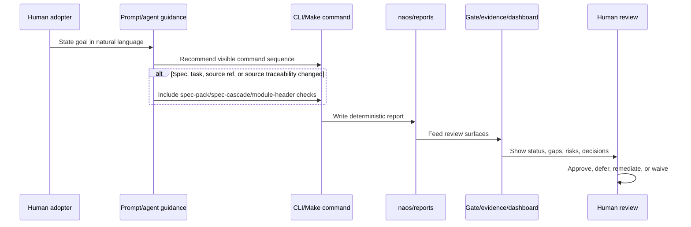
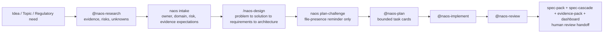
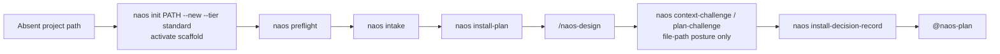
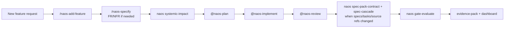
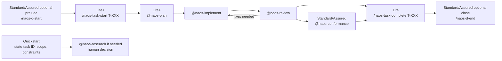
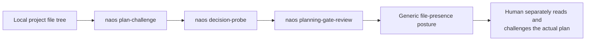
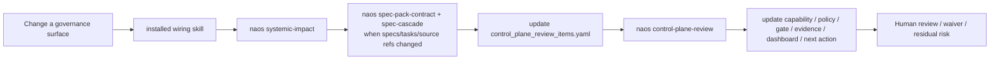
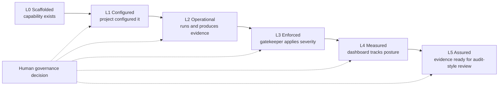

# NAOS Quick Reference

**Reference Schema Version**: 3.0
**NAOS Kit Compatibility**: v1.0.0+
**Status**: Active generated-project reference
**Purpose**: A practical, workflow-first front door for NAOS — how to take an idea, topic, repo, feature, or task and move it through the governed lifecycle. The complete prompt/agent/skill/CLI inventory lives in `NAOS_CATALOG.md` (a NAOS kit document, see note below); this file is the daily workflow map.

> **About file references in this guide.** `NAOS_CATALOG.md` and the `docs/…` files ship with the NAOS kit (the upstream package/repo) and are not copied into every generated project — open them in the kit source. `naos/gatekeepers.yaml` and `naos/maturity_levels.yaml` are seeded for the `lite` tier and above; `quickstart` projects do not include them. `naos/capability_state.yaml` is seeded for all tiers.

> **Profile availability.** Quickstart installs no prompts and only the
> `@naos-research` agent. Lite installs the bounded design/task prompts and the
> research/plan/implement/review agents. Standard/Assured install the full
> prompt and agent catalogue. A route below applies only when its file exists in
> `.github/prompts/` or `.github/agents/`; otherwise use the stated plain-language
> or deterministic-command fallback.

NAOS is a file-first governance control plane for AI-assisted SDLC. It keeps AI-assisted work tied to specs, tasks, code, tests, evidence, and review decisions. It produces evidence and findings; **humans decide durable outcomes**. NAOS does not prove legal or regulatory compliance, does not prove runtime safety, does not prove complete test coverage, does not guarantee secure code, and does not replace human review.

---

## 1. What NAOS Helps You Do

Bring NAOS an idea, topic, repo, requirement, or task. NAOS helps you:

1. research the context,
2. structure the problem,
3. define the solution,
4. derive requirements,
5. shape architecture,
6. challenge assumptions,
7. create bounded tasks,
8. implement with AI assistance,
9. collect deterministic evidence,
10. prepare human review.

The natural-language ("vibe") surface is the entry point: tell NAOS what you are trying to do, in prompts and agents. Behind it, the deterministic control plane records structure, evidence, traceability, and review posture. Both layers stay honest about what is `missing`, `not_configured`, `stale`, `waived`, or `experimental`.

> Research is not truth. Candidate requirements are not approved requirements. Generated specs are not approved until human-reviewed. CLI reports are deterministic evidence, not approval.

---

## If You Only Read One Page

Use this file as a router from plain-language intent to explicit NAOS
commands. Prompts and agents can help phrase the work, but the CLI/Make layer
records deterministic evidence and humans decide durable outcomes.

| You say... | Route | First explicit step | Review output |
| --- | --- | --- | --- |
| "I have a new project" | Greenfield setup | `naos adopt . --mode greenfield --dry-run` | adoption summary and decision record |
| "I have an existing repo" | Brownfield adoption | `naos repository-intelligence plan . --component-mode baseline` | source-bound plan before create-only activation and adoption reports |
| "My specs are ready; can implementation planning start?" | Implementation-readiness baseline (Lite+) | update `naos/PLANNING_BASELINES.yaml`, record an attributable `planning_baseline` decision, then run `naos plan-coherence` | live profile-aware readiness, digest, task-coverage, lineage, and decision findings |
| "I want to start a task" | Daily task lifecycle | `/naos-task-start TASK_ID` when installed; Quickstart: state task ID, scope, constraints, and evidence explicitly | task context and review handoff |
| "This task might be split across lanes" | Parallel lane planning | record `parallel_lane_opportunity` and `parallel_lane_decision` in the active card or `PRE_IMPLEMENTATION_ALIGNMENT.md`; if declared, run the handoff script and control-plane review | advisory lane posture, optional handoff report, HITL reason codes |
| "I am reviewing a PR" | PR/release evidence | `naos spec-pack-contract`, `naos spec-cascade`, `naos gate-evaluate`, `naos evidence-pack`, `naos dashboard` | template contract, traceability, gate, evidence, dashboard, PR-risk reports |
| "I am designing or changing UI" | UI evidence review | Standard/Assured: `/naos-ui-design-start`; otherwise state the UI scope explicitly; if enabled, run `naos design-traceability` and `naos ui-experience-quality` | object-identity evidence, quality-evidence gaps, human-review posture |
| "I changed governance files" | Systemic wiring | `naos systemic-impact`, `naos control-plane-review`; add `naos spec-pack-contract` and `naos spec-cascade` when specs/tasks/source refs changed | routed findings and next actions |
| "I need to compare missing Standard spec templates" | Spec-pack materialization | `naos spec-pack-materialize . --profile standard --dry-run` | bounded missing-file preview; not profile-transition evidence |
| "I have brownfield evidence to map" | Spec assembly worksheet | `naos spec-assembly-worksheet . --profile standard` | review-only candidate-to-spec worksheet |
| "AI-surface budget is degraded" | Context-health remediation | `naos ai-surface-budget`; use `ai-surface-health-review` skill where installed | slimmed surfaces, preserved anchors, residual-risk routing |
| "We may use model/provider-specific AI later" | Model-provider declaration review | `naos model-policy` | role declarations, mixed-tool bindings, cost/data posture, disabled-runtime review |
| "We have local model-use telemetry" | Model telemetry evidence review | `naos model-telemetry`; then `naos control-plane-review` when findings exist | session/task/model-role links, cost/latency exceptions, payload/credential field risks |
| "We have repo-local OpenCode config to review" | OpenCode config hygiene review | `naos opencode-config-hygiene`; then `naos control-plane-review` when findings exist | local config/instruction hygiene, MCP/plugin/model drift findings, no runtime activation |
| "We learned something that should change future behavior" | Governed learning lifecycle | `naos learning-loop-review`; use `governed-learning-lifecycle` skill where installed | candidate/active/history learning posture |
| "I changed Codex/Claude/plugin/IDE adapter guidance" | Adapter coherence | `naos adapter-coherence`; add `naos learning-loop-review` when learning drove the change | adapter drift, propagation, and non-claim findings |
| "I need stronger assurance" | Profile/gate/maturity | profile chooser, gate commands, maturity report | readiness posture and human decisions |

For `gate-status` and `gate-evaluate`, profile resolution order is `--profile`,
then `NAOS_PROFILE`, then the generated policy default. Initialization persists
the selected `lite`, `standard`, or `assured` tier in the generated project
policy, so bare calls to those gate commands use that project tier;
`quickstart` retains its `quickstart` fallback because it does not include the
full policy.



---

## 2. The Control Triad: Profiles · Gates · Maturity

Three concepts wire the natural-language flow to governance:

| Concept | What it answers |
| --- | --- |
| **Profile** | How strict should this project be right now? |
| **Gate** | What evidence must converge before moving forward? |
| **Maturity** | How developed is this capability in this project? |

> Profile controls severity. Gate checks evidence. Maturity describes readiness. **Human review decides durable outcomes.**

Advisory controls may *challenge* deterministic controls, but they may not *replace* them. Run deterministic primary controls first; treat optional semantic similarity, graph analytics, memory discrepancy detection, or LLMGrader-style second opinions as candidate/discrepancy inputs for human review. Advisory controls cannot approve work, certify outcomes, prove compliance, promote maturity, or become sole pass/fail authority.

---

## 3. Start From Your Situation

Portable preview generation is exercised on Linux with Python 3.11. Managed
`--activate` mutation is currently supported only on Darwin ARM64 with CPython
3.11–3.13; Linux, Windows, and other unsupported tuples refuse before target
mutation. On an unsupported host, generate and review an absent external
`--preview-dir`, then activate later on a supported host.

| If you have… | Start with | Then use | Main outputs |
| --- | --- | --- | --- |
| A vague idea or topic | `@naos-research` | `/naos-design` only where generated; otherwise stop at a reviewed candidate record | Profile-proportionate research record and, where available, specs |
| A new greenfield project | `naos-governance init /path/to/new-project --new --tier <tier> --archetype custom --backend static_only --activate` | `naos intake`, `/naos-design`, then human plan review; `naos plan-challenge` is a file-presence reminder only | Specs, adoption reports, task plan |
| An existing repo | `naos preflight`, inventory commands | `naos requirements-reconstruct --mode brownfield`, `naos traceability-gap-register --mode brownfield` | Candidate FR/NFRs, gaps, adoption decision |
| A feature request | `/naos-add-feature` where installed; Quickstart uses an explicit plain-language request | `@naos-plan` where installed, then `naos systemic-impact` | Requirement section, task card, impact report |
| A coding task | `/naos-task-start T-XXX` | `@naos-plan` → `@naos-implement` → `@naos-review` | Code, tests, evidence |
| A PR / release review | `@naos-conformance` on Standard/Assured; otherwise applicable deterministic commands plus human review | `naos gate-evaluate`, `naos evidence-pack`, `naos dashboard` where generated | Review evidence |
| A governance-surface change | Installed wiring skill under `.github/skills/` where present | `naos systemic-impact`, `naos control-plane-review` | Routed findings and residual risks |
| A lesson that may affect future action | `governed-learning-lifecycle` skill | `naos learning-loop-review`; add `naos ai-surface-budget` if AI surfaces change | Candidate/active/history learning findings |

---

## 4. Core Workflows

Each workflow is a horizontal journey. The natural-language prompts/agents drive the work; the CLI/Make commands record deterministic evidence. Gates and profiles apply underneath (see §7–§9).

### 4.1 Topic / Idea → Research → Specs → Plan

**When to use:** you have an idea, market topic, regulatory obligation, or rough product direction and need to convert it into a governed project structure.



- **Natural-language start:** *"Use `@naos-research`. Research this topic: [topic]. Identify evidence, assumptions, counterevidence, risks, contradictions, and unknowns. Do not write code. Prepare a candidate research record. Route to `/naos-design` only if that surface is present in `naos/profile_generated_surface_contract.json`."*
- **Human checkpoint:** approve the applicable profile inputs before an implementation-ready baseline. Lite requires requirements but does not require or synthesize architecture; Standard/Assured require requirements and architecture.
- **Current CLI boundary:** `naos plan-challenge` does not read or challenge the plan; the human review supplies that substantive assessment.
- **Do not claim:** research is not truth; candidate requirements are not final requirements.

#### Implementation-ready planning boundary (Lite+)

Draft and discovery plans may evolve before implementation. Use hybrid planning
with vertical delivery as the default. A horizontal foundation is allowed only
when it names a consuming vertical slice and the consumed result it changes.

1. Complete the applicable specifications: Lite binds `03-requirements.md` and
   marks architecture not applicable; Standard/Assured bind both
   `03-requirements.md` and `04-architecture.md`.
2. Complete the task registry and Pre-Implementation Alignment, then run the
   spec-pack and alignment-review checks.
3. Run `naos plan-coherence` while the baseline is draft and copy the reported
   `implementation_readiness.digest_candidates` into the ledger.
4. Record an attributable `planning_baseline` human-decision record, set the
   baseline to `implementation_ready`, and rerun `naos plan-coherence`.
5. Create a superseding baseline when requirements, applicable architecture,
   task decomposition, alignment, or bound evidence changes. Routine task
   status progress alone does not require replanning.

G2 evaluates this readiness live. A present but stale/failing report is not
enough. The result is structural evidence only: it does not approve
implementation, close tasks, merge results, release, or publish.

### 4.2 Greenfield Project Setup

**When to use:** a brand-new project that should be governed from the start.



- **Install vs adopt vs activate:** `init` puts NAOS files/CLI wrappers in the project; intake/preflight/install-plan *understand and plan* the project; `--activate` and explicit setup modules *enable* controls; prompts/agents/validators *operate* during delivery.
- **Human checkpoint:** review the install plan and decision record before treating setup as complete.
- **Do not claim:** installation is not adoption; scaffolded files are not configured controls.

### 4.3 Brownfield Project Adoption

**When to use:** an existing repository you want to bring under NAOS governance.

```mermaid
flowchart LR
    A["Existing repo"] --> B["repository-intelligence\nplan / enroll / apply / validate"]
    B --> C["init dry-run\nreview complete profile surface"]
    C --> D["separate managed create-only\ninit --activate"]
    D --> E["naos adopt . --mode brownfield"]
    E --> F["inventories / baseline / candidates / gaps"]
    F --> G["Human accepts / rejects / defers / edits"]
    G --> H["Adapt specs 01-10 / tasks / rules"]
    H --> I["gov-refresh / gates / native tests"]
    I --> J["Later managed change:\nupgrade plan / digest-bound apply / recover"]
```



- **Natural-language start:** *"Use `@naos-research`. Reconstruct candidate FR/NFRs from docs, source, tests, and workflows. Classify each as confirmed, supported, inferred, or hypothesized. Do not promote candidates without human review."*
- **Human checkpoint:** candidate requirements and traceability gaps need explicit disposition; generated specs/tasks are seeds until adapted to the project.
- **Do not claim:** reconstructed candidates are not approved requirements; baselines and optional GraphML navigation do not prove correctness or improved onboarding.

### 4.4 Add a Feature

**When to use:** adding a capability to an already-governed project.



- **Human checkpoint:** confirm the feature is linked to specs/tasks/traceability before implementation.
- **Do not claim:** an elicited feature spec is not an accepted requirement until reviewed.

### 4.5 Daily Task Lifecycle

**When to use:** routine bounded work against an existing task.



- Make/CLI commands are operational wrappers; they do not replace installed lifecycle prompts/agents. Lite routes directly from review corrections to native task completion because `@naos-conformance`, `/naos-d-start`, and `/naos-d-end` are not generated for Lite. Quickstart has no prompt lifecycle.
- **Human checkpoint:** close a task only after review and conformance evidence are handled.

### 4.5.1 Parallel Lane Planning And Handoff

**When to use:** a task has independent acceptance criteria, distinct path
scopes, dependency-unlocked chunks, frontend/backend/tests/docs split, high
context load, or a team wants explicit lane coordination.

Record the advisory posture first:

```yaml
parallel_lane_opportunity: parallel_possible
parallel_lane_decision: deferred   # sequential | declared | deferred
```

`parallel_possible` and `parallel_recommended` are suggestions only. They do
not activate handoff. For a solo developer, lanes can be logical checkpoints.
For teams, declared lanes should also have task claims, planned paths,
dependency/unlock evidence, tests/checks, and operator/session metadata.

When the project explicitly chooses `parallel_lane_decision: declared`, copy
`naos/lane_handoffs/_TEMPLATE.yaml` to a lane-specific file and run:

```bash
python scripts/naos_parallel_lane_handoff.py --profile standard --handoff naos/lane_handoffs/<lane>.yaml
naos control-plane-review --profile standard
```

The handoff report and control-plane route are review evidence. They do not
create lanes automatically, dispatch agents, create branches/worktrees, run
tests, approve work, merge, close tasks, release, certify, attest, activate
runtime/MCP/memory/provider/model surfaces, or prove compliance.

### 4.6 Lightweight Context Posture Before Human Plan Review

**When to use:** before a human reviews an implementation plan or significant decision, as a file-presence reminder only.



- **Natural-language start:** *"Run the lightweight context-posture commands, then separately review this plan's assumptions, architecture, evidence, risks, scope, and acceptance criteria."*
- **Current limitation:** these commands enumerate local file-path signals. They do not accept, read, or substantively evaluate a draft plan, decision record, gate state, source-file contents, or prior reports.
- **Human checkpoint:** the reviewer—not these generic reports—identifies and resolves plan-specific decisions.
- **Do not claim:** a challenge report has assessed or approved the plan.

### 4.7 PR / Evidence / Review Handoff

**When to use:** preparing changed code and tests for governed review.


- **Do not claim:** CI/evidence output is review evidence, not PR approval, security proof, deployment authorization, or proof of compliance.

### 4.8 Governance-Surface Change

**When to use:** you change a prompt, agent, skill, policy, validator, gate, dashboard, spec, capability, or instruction surface.



Installed NAOS skills live under `.github/skills/<skill-name>/SKILL.md` and
are profile-gated. For governance-surface changes, use
`.github/skills/systemic-capability-wiring/SKILL.md` when installed
(assured/full catalogue or explicitly added); otherwise use
`.github/skills/systemic-wiring/SKILL.md` where installed plus
`naos systemic-impact` / `naos control-plane-review` for the same review
obligation. Do not claim a named skill was loaded if its file is absent. When
`ai-surface-budget` reports `warning` or `degraded`, including for
profile/generated `.ai/RULES.md`, use `ai-surface-health-review` where
installed to slim loaded surfaces without deleting anchors or inflating
thresholds. When a lesson may change future behavior, use
`governed-learning-lifecycle` where installed and keep candidate, active, and
historical learning separated.

---

## 5. Minimal Command Recipes

Three lanes by intent. Examples use `standard`; change the profile deliberately
to `quickstart`, `lite`, `standard`, or `assured`. Add `--naos-root`,
`--policy`, `--json`, `--strict`, or output paths where supported.

**First run (install evidence route):**
```bash
python -m naos_governance.cli doctor
naos-governance first-run --profile standard --mode greenfield
```

`first-run` performs doctor, adoption dry-run, setup recommendations,
profile-baseline setup-module dry-run, evidence pack, and dashboard generation.
Review dry-run outputs before enabling modules. Dry-run adoption does not
install `Makefile.naos`; run installed-project validators only after NAOS files
have been activated or materialized intentionally. Smoke output is review
evidence only; it is not approval, certification, proof of compliance,
secure-code proof, or proof of runtime safety.

**Smoke (after install / quick orientation):**
```bash
PROFILE=standard
naos claims --profile "$PROFILE"
naos setup-recommendations --profile "$PROFILE"
naos governance-bypass-posture --profile "$PROFILE"
naos external-evidence-ingest --profile "$PROFILE"          # add --source scan.sarif when available
naos ai-surface-budget --profile "$PROFILE"
naos learning-loop-review --profile "$PROFILE"
naos self-check --profile "$PROFILE"
naos spec-pack-contract --profile "$PROFILE"
naos spec-pack-materialize . --profile "$PROFILE" --dry-run
naos spec-assembly-worksheet . --profile "$PROFILE"
naos spec-cascade --profile "$PROFILE"
naos gate-status --profile "$PROFILE"
naos plan-coherence --profile "$PROFILE"
naos dashboard --profile "$PROFILE" --json-output naos/reports/dashboard_summary.json
```

**Task work (active card):**
```bash
PROFILE=standard
TASK_ID=T-001
naos task-context --task "$TASK_ID" --profile "$PROFILE"
naos test-evidence-map --profile "$PROFILE"
naos test-evidence --profile "$PROFILE"
naos ac-completion-evidence --profile "$PROFILE"
naos harness-trace-import --source naos/harness_traces/example.jsonl --profile "$PROFILE"
naos duplicate-function-hygiene --profile "$PROFILE"
naos secret-hygiene --profile "$PROFILE"
naos test-quality-hygiene --profile "$PROFILE"
naos dependency-integrity --profile "$PROFILE"
naos package-reality --profile "$PROFILE"
naos api-symbol-reality --profile "$PROFILE"
naos pr-risk-classify --profile "$PROFILE"
naos plan-coherence --profile "$PROFILE"
naos model-telemetry --profile "$PROFILE"            # when optional local model telemetry evidence is enabled
naos opencode-config-hygiene --profile "$PROFILE"    # when optional repo-local OpenCode config hygiene is enabled
naos design-traceability --profile "$PROFILE"        # when optional UI object identity is enabled
naos ui-experience-quality --profile "$PROFILE"      # when optional UI quality evidence is enabled
naos spec-pack-contract --profile "$PROFILE"
naos spec-pack-materialize . --profile "$PROFILE" --dry-run
naos spec-assembly-worksheet . --profile "$PROFILE"
naos spec-cascade --profile "$PROFILE"
naos gate-evaluate --profile "$PROFILE"
naos evidence-pack --profile "$PROFILE"
```

**Reviewer / assured handoff:**
```bash
PROFILE=assured
SCAN_SARIF=scan.sarif
naos evidence-attestation --profile "$PROFILE"
naos evidence-sign --profile "$PROFILE"
naos evidence-verify --profile "$PROFILE"
naos evidence-conflicts --profile "$PROFILE"
naos governance-bypass-posture --profile "$PROFILE"
naos external-evidence-ingest --source "$SCAN_SARIF" --profile "$PROFILE"
naos ai-surface-budget --profile "$PROFILE"
naos capability-maturity --profile "$PROFILE"
naos control-plane-review --profile "$PROFILE"
naos spec-pack-contract --profile "$PROFILE"
naos spec-pack-materialize . --profile "$PROFILE" --dry-run
naos spec-assembly-worksheet . --profile "$PROFILE"
naos spec-cascade --profile "$PROFILE"
naos pr-risk-classify --profile "$PROFILE"
naos pr-governance-summary --profile "$PROFILE"
naos plan-coherence --profile "$PROFILE"
naos sarif-export --profile "$PROFILE"
```

Quickstart is advisory and installs no CI by default. Lite is the first CI-friendly tier (`.github/workflows/naos-control-plane-ci.yml`). Standard and assured run the same chain with stronger profile/policy behavior. CI surfaces findings; humans still decide maturity movement, waivers, residual risks, remediation, and release readiness.

---

## 6. Evidence Status and Human Review Boundaries

| Status | Meaning | Action |
| --- | --- | --- |
| `ready` | Evidence appears available for review | Human reviews |
| `missing` | Expected artifact absent | Generate or explain |
| `not_configured` | Capability not configured | Configure or accept scope |
| `stale` | Evidence older than its source/config | Refresh |
| `waived` | Known gap accepted temporarily | Review residual risk |
| `experimental` | Advisory/future posture | Do not treat as authority |

Do not manually greenwash `missing`, `not_configured`, `stale`, `waived`, or `experimental` evidence into a pass. Do not silently delete, merge, or rewrite security, encryption, authentication, authorization, database, public-API, or regulatory-control code without human/profile-based approval. Waivers and residual risks stay visible.

`assured` is a profile name, not certification, proof of compliance, approval, or proof of runtime safety. Public reviewer guidance lives in `docs/AUDIT_PLAYBOOK.md`, `docs/NAOS_THREAT_MODEL.md`, `docs/ASSURED_PROFILE_ACTIVATION.md`, and `docs/BEHAVIORAL_AUDIT_ENABLEMENT.md` — guidance, not approval.

Exported findings (e.g. SARIF via `naos sarif-export`) carry deterministic findings by default; advisory findings require explicit inclusion and remain candidate/discrepancy records, not authority.

---

## 7. Profiles in Practice

| Profile | Workflow feel | Evidence expectation | Gate behavior |
| --- | --- | --- | --- |
| `quickstart` | Explore and learn quickly | Scaffolded evidence is enough to start | Advisory |
| `lite` | Lightweight team discipline | Basic config and warnings | Warning |
| `standard` | Normal governed SDLC | Reports should exist and be current | Required where configured |
| `assured` | Reviewer/audit-style handoff | Evidence, waivers, owners, exceptions explicit | Blocking where configured |

Same workflow, different profile: as the profile strengthens, the *same* steps move from advisory hints toward required/blocking evidence — but human approval is always required for durable decisions. Canonical profile/enforcement definitions live in `naos/maturity_levels.yaml` (seeded for the `lite` tier and above; not present in `quickstart` projects).

---

## 8. Gate Checkpoints by Workflow

NAOS gates summarize what evidence should converge. Canonical definitions live in `naos/gatekeepers.yaml` (seeded for the `lite` tier and above; not present in `quickstart` projects).

| Gate | Name | Main question |
| --- | --- | --- |
| G0 | Install Readiness | Can NAOS run basic checks? |
| G1 | Context Readiness | Is project/AI governance context present? |
| G2 | Planning Gate | Are planning, roadmap/spec routing, and context evidence ready? |
| G3 | Scope Gate | Is task scope explicit before implementation? |
| G4 | Code Gate | Is source/module/function-index evidence present? |
| G5 | Test Evidence Gate | Is source-to-test evidence present where configured? |
| G6 | Evidence Gate | Are claims, reports, waivers, risks, and the evidence pack ready? |
| G7 | Behavioral Gate | Is behavioral readiness/impacter review tracked without overclaiming? |
| G8 | Advanced Architecture Readiness Gate | Are Tier 3/runtime/graph/digital-twin tracks explicit and advisory? |

**Workflow → gate map:**

| Workflow | Main gates |
| --- | --- |
| Install / initialize | G0, G1 |
| Topic research → specs | G1, G2, G6 |
| Greenfield setup | G0, G1, G2, G6 |
| Brownfield adoption | G1, G2, G3, G6 |
| Add feature | G2, G3, G4, G5, G6 |
| Daily implementation | G2, G3, G4, G5 |
| PR review | G4, G5, G6 |
| Assured handoff | G0–G6, sometimes G7/G8 |
| Advanced/experimental work | G7, G8 (advisory/readiness unless configured) |

---

## 9. Maturity in Practice



| Level | Name | Practical question | Example evidence |
| --- | --- | --- | --- |
| L0 | Scaffolded | Does NAOS provide the capability? | Template, schema, capability card |
| L1 | Configured | Has this project configured it? | Config, owners, profile, policy |
| L2 | Operational | Has it run and produced evidence? | `naos/reports/*.json` |
| L3 | Enforced | Do gates apply profile severity? | `gate_status.json`, `gate_evaluation.json` |
| L4 | Measured | Is posture visible over time? | Dashboard, summaries, trends |
| L5 | Assured | Is evidence complete enough for audit-style review? | Evidence pack, attestations, waivers, reviewer metadata |

Use `naos capability-maturity --profile standard` to produce readiness evidence. **NAOS evaluates maturity readiness; it does not automatically promote, certify, or approve maturity.** Final maturity decisions remain project governance decisions (see `naos/capability_state.yaml`).

---

## 10. Where To Go Next

In the NAOS kit (not copied into generated projects — open in the kit source):

- **`NAOS_CATALOG.md`** — complete prompt/agent/skill/CLI inventory and usage scenarios (canonical).
- **`docs/CONTROL_PLANE.md`** — governance architecture: capability contracts, policy, gates, validators, evidence, dashboard.
- **`docs/ADOPTION_GUIDE.md`** — greenfield/brownfield/non-developer adoption strategy.
- **`docs/tutorials/PROFESSIONAL_ADOPTION_ENGINE.md`** — connected preflight → intake → inventory → challenge → baseline → decision-record walkthrough.

In your generated project:

- **`naos/capability_state.yaml`** — adopter capability-state declarations (all tiers).
- **`naos/gatekeepers.yaml`**, **`naos/maturity_levels.yaml`** — canonical gate and maturity definitions (seeded for `lite` tier and above; not present in `quickstart`).

---

## 11. Governance Reference

Compact reference for the governance invariants that operate underneath every workflow above. The control-plane flow is: commands/prompts/agents -> capabilities -> **central policy** -> capability state -> validators -> systemic-impact review -> spec-pack contract and spec-cascade/source traceability where applicable -> gates -> evidence pack -> dashboard -> remediation/waiver/next action.

### Preventive / Detective / Remediation

- **Preventive** (before generation/modification): inspect specs, task context, and capability constraints; inspect existing source and `FUNCTION_INDEX.yaml` before creating new functions; prefer reuse over duplication; check that `specs/04-architecture.md` changes are linked.
- **Detective** (after generation/modification): run relevant validators and gates; refresh source-to-test evidence, evidence pack, and dashboard; surface `missing`/`not_configured`/`stale`/`waived`/`experimental` evidence honestly.
- **Remediation**: findings produce remediation options or waiver/residual-risk decisions. Do not silently rewrite security, auth, database, public-API, or regulatory-control code without human/profile approval. Waivers and residual risks stay visible — never converted into a pass.

### Control-Plane Self-Review

When governance surfaces change, route the change through control-plane self-review (a file-first review discipline, not a runtime orchestrator). Run or recommend `naos systemic-impact` when governed artifact families change (`configure → evaluate → report → review → update → re-evaluate`), and route findings via `naos/control_plane_review_items.yaml` + `naos control-plane-review`. See workflow §4.8. Use the installed wiring skill under `.github/skills/` where present; use `systemic-capability-wiring` when installed, otherwise use `systemic-wiring` for the same orphan-surface review obligation.

### Spec 04 Linkage Rule

If `specs/04-architecture.md` changes, check it is linked to `specs/01-problem.md`, `specs/02-solution.md`, `specs/03-requirements.md`, `naos/TASK_REGISTRY.yaml`, `TRACEABILITY_MATRIX.md` (where present), affected capability contracts, relevant gate/evidence expectations, and known gaps/residual risks. Run or recommend `naos spec-pack-contract`, `naos spec-pack-materialize --dry-run`, `naos spec-assembly-worksheet`, and `naos spec-cascade` when specs, profile-required spec files, brownfield evidence, tasks, source spec references, or source traceability changed. Default is profile-aware review/routing: advisory in `quickstart`, warning in `lite`, required where configured in `standard`, blocking only in `assured` when an implemented validator/gate enforces it.

### Research / Autoresearch Feedback

Research, autoresearch, trend-review, and external-analysis outputs should not remain standalone when actionable. Route findings into capability contracts, central policy, gatekeepers/validators, roadmap/crosswalk mappings, task registry, known gaps/residual risks, evidence pack/dashboard, next-action recommendations, AI instruction surfaces, or specs 01–04. Keep advisory/profile-aware unless an implemented validator or gate enforces it.

### Canonical Module Header

Use one canonical module header per source module unless a language/framework convention requires otherwise. Do not create a second header/docstring with overlapping metadata. Validate with `naos module-headers`.

```text
Module: src/path/to/module.py

Purpose:
    Short module-level description.

Implements:
    - FR-XXX: Requirement/control name
    - NFR-XXX: Non-functional requirement/control name

Tasks:
    - T-XXX: Task title
    - T-YYY: Task title

Specs:
    - specs/03-requirements.md#fr-xxx
    - specs/04-architecture.md#architecture-section

Rationale:
    Short paragraph explaining why this module exists, why the logic belongs
    here, what boundary it owns, and how it avoids duplication or architecture
    drift.

Design notes:
    - Optional stable architectural constraints/patterns.
```

Plural `Implements`, `Tasks`, and `Specs` labels are intentional. Multiple IDs are allowed when genuinely applicable. Keep `Rationale` concise and module-level. Update the header when module purpose materially changes, and avoid duplicate/stale module headers.

### Optional Semantic / Similarity Layer

Core NAOS is deterministic, file-first, portable, and has no semantic model dependency. Optional semantic/similarity support is project-configured, disabled by default, provider-neutral, and evidence-backed (e.g. `sentence-transformers/all-mpnet-base-v2` only when a project explicitly enables it). The generic kit does not require embeddings, GPU, or semantic duplicate detection by default; semantic candidates are advisory inputs for human review, not authority.

---

## Annexes

The annexes are compact, workflow-oriented subsets. The **complete** inventories (16+1 prompts, 7 agents, 25 skills, all CLI commands and Make targets) are canonical in the NAOS kit's `NAOS_CATALOG.md`. Use only items present in your generated project. For a valid already managed project, normal upgrade and `--dry-run` are plan-only; persist an external immutable plan and use the separate digest-bound apply or recovery command for mutation.

### Annex A — Prompt Inventory (kit superset)

Full inventory (16 + 1): `NAOS_CATALOG.md`.

| Prompt | Availability | Best use | Main output | Next handoff |
| --- | --- | --- | --- | --- |
| `/naos-design` | Lite+ | Turn an idea/topic into profile-required specs | quickstart: none; lite: 01→03; standard/assured: 01→10 | `@naos-plan` |
| `/naos-specify` | Standard/Assured | Add one FR/NFR surgically | Requirement section with ACs | `@naos-plan` |
| `/naos-add-feature` | Lite+ | Mid-project feature elicitation | Feature impact + spec update | installed planning route |
| `/naos-d-start` | Standard/Assured | Start daily session | Requested context and next action | `/naos-task-start` |
| `/naos-task-start` | Lite+ | Begin a specific task | Scope, constraints, context | `@naos-plan` |
| `/naos-d-commit` | Lite+ | Pre-commit review | Commit-readiness findings | commit or fix |
| `/naos-task-complete` | Lite+ | Close task with evidence | Requested completion review | Standard/Assured may use `/naos-d-end` |
| `/naos-d-end` | Standard/Assured | End session | Requested summary and next actions | next session |
| `/naos-t-test-failure` | Lite+ | Investigate failing tests/CI | Root-cause plan | installed review/implementation route |
| `/naos-t-precommit` | Standard/Assured | Triggered pre-commit review | Governance/quality findings | fix or commit |
| `/naos-w-plan` | Standard/Assured | Weekly planning | Weekly focus | task lifecycle |
| `/naos-w-review` | Standard/Assured | Weekly retrospective | Lessons and follow-ups | backlog updates |
| `/naos-m-review` | Standard/Assured | Monthly governance health | Improvement items | `@naos-conformance` |
| `/naos-ui-design-start` | Standard/Assured | UI design session | UI constraints + component plan | `@naos-implement` |

### Annex B — Agent Inventory

| Agent | Availability | Role | Use when | Should not | Typical handoff |
| --- | --- | --- | --- | --- | --- |
| `@naos-research` | All profiles | Read-only evidence gathering | Topic/repo/spec/task uncertainty exists | Implement changes or promote candidates | human review, then a profile-available planning/design route |
| `@naos-plan` | Lite+ | Task planning and decomposition | Requirements/specs need conversion to tasks | Write code | `@naos-implement` |
| `@naos-implement` | Lite+ | Bounded implementation | Task is approved and scoped | Expand scope silently | `@naos-review` |
| `@naos-review` | Lite+ | Quality/spec/test/governance review | Implementation is ready for review | Approve release alone | `@naos-implement` or installed conformance route |
| `@naos-conformance` | Standard/Assured | Governance audit | Before closure, PR, monthly review | Replace human approval | human decision |
| `@naos-debug` | Standard/Assured | Root-cause analysis | CI/test/bug complexity is high | Patch without verification | `@naos-implement` |
| `@naos-triage` | Standard/Assured | Classify incoming work | New issue/request/bug arrives | Implement directly | `@naos-plan` or `@naos-debug` |

### Annex C — Skill Inventory (most-used)

Full inventory (25 skills, including the `cookbook-*` family): `NAOS_CATALOG.md`.

| Skill | Use when | Helps with |
| --- | --- | --- |
| `governed-coding-execution` | Implementing/changing code, config, schema, workflow, or governance surfaces; before claiming done | Evidence-first execution loop and completion-claim ledger |
| `systemic-wiring` | Any project change that may affect modules, APIs, schemas, config, docs, tests, hooks, dependencies, AI surfaces, or operations | Avoiding stale, orphaned, or contradictory surfaces |
| `systemic-capability-wiring` | Assured/full catalogue or explicitly added; any NAOS capability, validator, prompt, agent, workflow, doc, or config change | Expanded NAOS control-plane wiring checklist |
| `ai-surface-health-review` | AI-surface budget is `warning` or `degraded` | Safe slimming, anchor preservation, baseline discipline |
| `governed-learning-lifecycle` | Capturing, promoting, replacing, forgetting, or redacting lessons | Evidence-backed learning and action boundaries |
| `function-discovery` | Before creating new functions | Reuse and duplicate-risk review |
| `spec-extract` | During implementation/review | Finding relevant FR/NFR/spec anchors |
| `gov-refresh` | After meaningful governance or code changes | Refreshing derived governance views |
| `debug` | Non-trivial bug investigation | Reproduce → isolate → root cause → verify |
| `forensic-audit` | Deep evidence-backed audit or release/security review | Six-pass audit method, truth matrix, false-positive hunter |
| `cognitive-checkpoint` | Long/multi-step sessions | Durable handoff/compact summaries |
| `strategic-compact` | Multi-session or multi-workstream tasks | Continuity and state compression |
| `systemic-wiring` | Cross-project module/API/schema/config/docs/test/hook/dependency drift review | Generic wiring check before escalating to forensic audit |
| `test-driven-development` | Behavior changes tied to FR/NFR/SCEN evidence | Red-green-refactor discipline and evidence handoff |

### Annex D — CLI Command Inventory (common, grouped by job)

Full command surface and options: `NAOS_CATALOG.md` and `naos commands`.

### Adoption and setup
| Command | Use when | Writes / updates | Boundary |
| --- | --- | --- | --- |
| Installed `naos repository-intelligence plan|enroll|apply|validate` | Qualify an existing repository before scaffold activation | external plan, then capability-owned provenance and generated intelligence | Runtime stays in installed NAOS/kit rather than the default scaffold; SQLite/FTS baseline; graph optional; does not approve adoption |
| `naos-governance init . --tier <tier> --archetype custom --backend static_only --activate` | Managed create-only initial installation on the supported Darwin ARM64 CPython 3.11–3.13 tuple | profile governance surface plus provenance and receipt | Unsupported tuples, collisions, and `--force` refuse; does not make seeds project-specific |
| `naos upgrade . --tier <tier> --plan-out /external/plan.json` | Plan an already managed profile transition | absent external immutable plan only | Target unchanged; normal and `--dry-run` planning are identical |
| `naos upgrade . --apply-plan /external/plan.json --expect-plan-digest SHA256` | Apply one reviewed managed transition | eligible kit-owned derived leaves, journal, receipt | Revalidates exact provenance/current/source state; adopter content is preserved; `--force` refuses |
| `naos upgrade . --recover` | Recover an interrupted managed transaction | recovery or rollback evidence | Darwin regular-file adapter only; conflicts are preserved |
| `naos preflight` | Inspect readiness before adoption | `preflight_report.json` | Does not approve setup |
| `naos intake` | Capture adopter answers | `intake_report.json` | Unknowns remain unknown |
| `naos install-plan` | Plan adoption/install choices | `install_plan.json` | Does not install automatically |
| `naos adopt . --mode greenfield\|brownfield --dry-run` | Orchestrate adoption evidence | report artifacts | Requires secure directory-descriptor writes; otherwise fails closed before report creation |
| `naos adopt . --mode greenfield\|brownfield --no-write-preview` | Preview adoption without side effects | nothing | No report or activation writes |
| `naos add setup-module profile_baseline --profile standard --dry-run` | Plan an explicit optional module | selected absent files on direct apply | Dry-run first; eligible kit-owned collisions require `--plan-out` and central digest-bound apply |

### Research, challenge, and reconstruction
| Command | Use when | Writes / updates | Boundary |
| --- | --- | --- | --- |
| `naos context-challenge . --challenge-mode install` | Enumerate generic local file-path presence before setup review | challenge report | Does not read or evaluate project content |
| `naos repo-context-challenge` | Enumerate generic local file-path presence before brownfield review | repo challenge report | Does not read or evaluate repository content |
| `naos plan-challenge` | Inspect generic local-file posture before plan review | plan challenge report | Does not parse or evaluate a plan |
| `naos decision-probe` | Inspect generic local-file posture before decision review | decision probe report | Does not parse or evaluate a decision record |
| `naos planning-gate-review` | Inspect generic local-file posture before gate review | planning gate report | Does not parse or evaluate gate state |
| `naos requirements-reconstruct --mode brownfield` | Infer candidate requirements | candidate requirements report | Candidates need human promotion |
| `naos traceability-gap-register --mode brownfield` | Find missing links | gap register | Gaps need disposition |
| `naos existing-resource-inventory` / `naos ai-artifact-inventory` / `naos brownfield-baseline --mode brownfield` | Inventory existing repo evidence | inventory/baseline reports | Inventory is not approval |
| `naos ai-code-provenance` | Package AI-assisted code provenance declarations for review | `ai_code_provenance.json` | Not legal/authorship/ownership proof |
| `naos compliance-posture` | Package adopter-declared regulated-context evidence for review | `compliance_posture.json` | Not legal/compliance/regulatory proof |

### Planning, task, and session
| Command | Use when | Writes / updates | Boundary |
| --- | --- | --- | --- |
| `naos task-context --task T-XXX` | Build bounded task context pack | `task_context_pack.json` | Bounded aid, not authority |
| `naos task-lifecycle --task T-XXX` | Inspect exact active/completed lifecycle | `task_lifecycle.json` | Unknown, unsupported legacy status, or recovery mismatch is non-zero |
| `naos task-complete --task T-XXX` | Record native completion | completed history + registry/card transition | Verified delivery requires existing test/evidence plus approved exact-task `task_delivery`; not merge/release/evidence authority |
| `naos research-record RECORD` | Validate candidate research | `research_record_validation.json` | Candidate-only; explicit transition required |
| `naos composed-traceability` | Compose explicit relationship links | `composed_traceability.json` | Structural links do not prove semantics |
| `naos session-start\|session-checkpoint\|session-end --task T-XXX` | Coordinate session lifecycle | `session_lifecycle.json` | Does not write memory/approve |
| `naos learning-loop-review` | Review candidate, active, and historical learning records | `learning_loop_review.json` | Does not write memory or mutate AI surfaces |
| `naos adapter-coherence` | Review Codex/Claude/plugin/IDE adapter coherence and propagation hashes | `adapter_coherence.json` | Flags stale/unreviewed adapters; does not mutate them |
| `naos model-telemetry` | Review optional local model telemetry evidence declarations | `model_telemetry_evidence.json` | Not provider calls, runtime routing, complete cost proof, approval, or proof of compliance |
| `naos failure-mode-observations` | Aggregate configured local report findings by canonical failure mode for dashboard/evidence/SARIF/gate/learning review visibility | `failure_mode_observations.json` | Not automatic learning, numeric risk score authority, provider/model calls, MCP/Engram/memory activation, approval, blocking, release authority, or proof of compliance |
| `naos opencode-config-hygiene` | Review optional repo-local OpenCode config hygiene declarations | `opencode_config_hygiene.json` | Not OpenCode execution, MCP/memory activation, provider/model calls, credential validation, approval, or proof of compliance |
| `naos design-traceability` | Review optional local UI object-identity declarations | `design_traceability.json` | Not design-tool sync, quality proof, approval, or proof of compliance |
| `naos ui-experience-quality` | Review optional local UI quality evidence declarations | `ui_experience_quality.json` | Not screenshot generation, design-quality proof, UI approval, certification, or proof of compliance |

### Source and test checks
| Command | Use when | Writes / updates | Boundary |
| --- | --- | --- | --- |
| `naos test-evidence-map` / `naos test-evidence` | Build/validate source-to-test evidence | test evidence reports | Does not prove coverage |
| `naos ac-completion-evidence` | Validate declared AC/SCEN evidence plus optional Git subject binding and supersession | `ac_completion_evidence.json` | Local structural review only; not execution, signing, identity, AC correctness, approval, or coverage proof |
| `naos harness-trace-import` | Import local JSONL/NDJSON records as declared trace events | `harness_trace_import.json` | Does not execute harnesses or prove behavior |
| `naos duplicate-function-hygiene` | Detect normalized duplicate Python function bodies | `duplicate_function_hygiene.json` | Does not prove semantic equivalence |
| `naos secret-hygiene` | Detect obvious secret-like local findings | `secret_hygiene.json` | Does not prove repository is secret-free |
| `naos test-quality-hygiene` | Detect tests with missing/trivial assertions | `test_quality_hygiene.json` | Does not prove behavioral correctness |
| `naos dependency-integrity` | Detect undeclared or unresolved Python imports | `dependency_integrity.json` | Does not prove package safety |
| `naos package-reality` | Review package/SBOM/provenance/hash and opt-in registry evidence | `package_reality.json` | Does not prove package safety, SBOM completeness, or supply-chain assurance |
| `naos api-symbol-reality` | Verify explicitly declared Python API symbols by source inspection | `api_symbol_reality.json` | Does not import targets or prove API behavior |
| `naos pr-risk-classify` | Classify deterministic PR diff risk surfaces | `pr_risk_classification.json` | Not PR approval or security proof |
| `naos module-headers` | Check module-header traceability | `module_header_traceability.json` | Does not prove code correctness |
| `naos spec-pack-contract` | Check spec-pack template contract, profile applicability, and deterministic reference resolution | `spec_pack_contract.json` | Does not prove spec quality or completeness |
| `naos spec-pack-materialize` | Preview or copy missing profile-required spec-pack files | `spec_pack_materialization.json` | Does not fill or approve specs |
| `naos spec-assembly-worksheet` | Map adoption evidence and candidate requirements to manifest-declared specs for review | `spec_assembly_worksheet.json` | Does not promote candidates or prove traceability |
| `naos spec-cascade` | Check requirement/task/source cascade coherence, including unresolved source spec references | `spec_cascade_coherence.json` | Does not prove complete traceability or code correctness |

### Evidence and gates
| Command | Use when | Writes / updates | Boundary |
| --- | --- | --- | --- |
| `naos claims` | Validate claims vs evidence/policy | claims report | Not certification |
| `naos self-check` | Aggregate control-plane posture | self-check report | Not approval |
| `naos ai-surface-budget` | Check AI/governance instruction context health | `ai_surface_context_budget.json` | Not hallucination prevention or threshold tuning |
| `naos governance-bypass-posture` | Report local hook/CI bypass posture | `governance_bypass_posture.json` | Not bypass prevention or CI proof |
| `naos external-evidence-ingest --source scan.sarif` | Summarize local SARIF and preserve opaque per-result review records | `external_evidence_ingest.json` | Unverified evidence; omits messages and does not map risk/controls |
| `naos spec-pack-contract` | Evaluate profile-required spec files, not-applicable-by-profile files, required sections, anchors, reference codes, and sync markers | `spec_pack_contract.json` | Template contract conformance only |
| `naos spec-pack-materialize` | Preview/copy missing profile-required spec files from the local canonical template source | `spec_pack_materialization.json` | Template copy evidence only |
| `naos spec-assembly-worksheet` | Map brownfield evidence/candidates/gaps to specs for review | `spec_assembly_worksheet.json` | Review worksheet only |
| `naos spec-cascade` | Evaluate spec/task/source traceability findings, including unresolved source FR/NFR/AC/SCEN references | `spec_cascade_coherence.json` | Structural review evidence only |
| `naos gate-status` / `naos gate-evaluate` | Summarize/evaluate G0–G8 | gate reports | Profile policy decides severity |
| `naos evidence-attestation` / `naos evidence-conflicts` | Local digest + conflict detection | attestation/conflict reports | Not signing, approval, or conflict resolution |
| `naos evidence-sign` / `naos evidence-verify` | Emit an adopter-signable envelope and verify local tamper-evidence/signature-entry presence | `evidence_envelope.json`, `evidence_verification.json` | Not NAOS signing, third-party signature validation, identity authentication, non-repudiation, or approval |
| `naos plan-coherence [--diff-base <ref>]` | Review active task claims against registry/module linkage; optionally compare changed files to alignment path declarations | `plan_coherence.json` | Not work authorization, sequencing, conflict resolution, or plan approval; not semantic drift proof |
| `naos evidence-pack` / `naos dashboard` | Bundle + summarize for review | evidence pack, `DASHBOARD.md` | Review surface, not approval |
| `naos capability-maturity` | Evaluate maturity readiness | `capability_maturity.json` | Does not promote maturity |

### Governance-surface review and export
| Command | Use when | Writes / updates | Boundary |
| --- | --- | --- | --- |
| `naos systemic-impact [--changed-path <path> ...] [--review-record <yaml> --require-resolved]` | Governed artifact families change; use exact paths for stable-card closure | `systemic_impact_review.json` with typed obligations and preserved dispositions | Does not infer Git changes, edit targets, or prove complete semantic impact |
| `naos control-plane-review` | Route review/research findings | `control_plane_review.json` | Not governance-correctness proof |
| `naos governance-bypass-posture` | Surface hook/CI/tier bypass posture | `governance_bypass_posture.json` | Not prevention, approval, or proof of compliance |
| `naos external-evidence-ingest` | Bring local SARIF into per-result review evidence | `external_evidence_ingest.json` | Control-plane prompts are advisory, not durable disposition or gate authority |
| `naos pr-risk-classify` | Surface risky PR path/diff changes | `pr_risk_classification.json` | Not malware analysis, sandbox execution, or proof of compliance |
| `naos pr-governance-summary` | Summarize PR-time evidence | `pr_governance_summary.json` | Review evidence, not approval |
| `naos sarif-export` | Export findings for interop | `naos_findings.sarif` | Interop output, not authority |

### Annex E — Make Target Inventory (wrapper map)

Make targets wrap the equivalent CLI commands. Full list: `templates/Makefile.naos` and `NAOS_CATALOG.md`.

| Make target | Equivalent CLI | Use when |
| --- | --- | --- |
| `naos-claims` | `naos claims` | Claims validation |
| `naos-self-check` | `naos self-check` | Aggregate control-plane posture |
| `naos-gate-status` | `naos gate-status` | Gate readiness summary |
| `naos-gate-evaluate` | `naos gate-evaluate` | Profile-aware gate evaluation |
| `naos-plan-coherence` | `naos plan-coherence` | Task-claim/registry/module-linkage review evidence |
| `naos-evidence-sign` | `naos evidence-sign` | Emit adopter-signable evidence envelope |
| `naos-evidence-verify` | `naos evidence-verify` | Verify local tamper-evidence and report signature-entry presence |
| `naos-evidence-pack` | `naos evidence-pack` | Reviewer evidence bundle |
| `naos-dashboard` | `naos dashboard` | Human-readable dashboard |
| `naos-systemic-impact` | `naos systemic-impact` | Systemic impact review |
| `naos-control-plane-review` | `naos control-plane-review` | Governance-surface routing |
| `naos-learning-loop-review` | `naos learning-loop-review` | Governed learning lifecycle review |
| `naos-governance-bypass-posture` | `naos governance-bypass-posture` | Hook/CI bypass posture evidence |
| `naos-external-evidence-ingest` | `naos external-evidence-ingest` | Local SARIF review evidence |
| `naos-spec-pack-contract` | `naos spec-pack-contract` | Spec-pack template contract, profile applicability, and reference resolution |
| `naos-spec-pack-materialize` | `naos spec-pack-materialize . --dry-run` | Missing profile-required spec file materialization preview |
| `naos-spec-assembly-worksheet` | `naos spec-assembly-worksheet .` | Brownfield evidence-to-spec worksheet |
| `naos-spec-cascade` | `naos spec-cascade` | Requirement/task/source coherence review |
| `naos-ai-surface-budget` | `naos ai-surface-budget` | AI/governance instruction context-health review |
| `naos-ai-code-provenance` | `naos ai-code-provenance` | AI-assisted code provenance review packaging |
| `naos-compliance-posture` | `naos compliance-posture` | Compliance posture review packaging |
| `naos-pr-risk-classify` | `naos pr-risk-classify` | PR diff risk review evidence |
| `naos-model-telemetry` | `naos model-telemetry` | Optional local model telemetry evidence review |
| `naos-opencode-config-hygiene` | `naos opencode-config-hygiene` | Optional repo-local OpenCode config hygiene review |
| `naos-design-traceability` | `naos design-traceability` | Optional UI object-identity evidence review |
| `naos-ui-experience-quality` | `naos ui-experience-quality` | Optional UI quality evidence review |
| `gov-refresh` | (legacy/project refresh) | Refresh derived governance artifacts where installed |

Use only targets present in your generated project. Make/CLI commands are wrappers, not the lifecycle; do not create lifecycle Make targets (`naos-start`, `naos-plan`, `naos-implement`, …) unless the kit adds them.

### Annex F — Gatekeeper Inventory

Compact view in §8. Canonical definitions, inputs, and known limitations: `naos/gatekeepers.yaml`.

### Annex G — Capability Maturity Levels

Compact view in §9. Canonical level criteria and profile targets: `naos/maturity_levels.yaml`. Adopter capability declarations: `naos/capability_state.yaml`.

### Annex H — Core File / Report Authority Map

A reduced map of the files you touch most. The complete generated-report authority map (every `naos/reports/*.json`, adoption-engine artifact, and rules file) is described in `NAOS_CATALOG.md` and the per-command notes in `docs/CONTROL_PLANE.md`.

| Category | Core files | Editable? | Updated by |
| --- | --- | --- | --- |
| Specs | `specs/01-problem.md` … `specs/04-architecture.md`, `specs/10-execution.md`, `specs/spec_manifest.yaml` | Manual / AI-assisted draft | Human-reviewed prompt workflow |
| Tasks | `naos/TASK_REGISTRY.yaml`, `naos/active/*.md` | Manual / workflow-updated | Human/project workflow |
| Traceability | `TRACEABILITY_MATRIX.md` (where present) | Manual / generated links | Human/project workflow |
| Spec pack contract | `naos/reports/spec_pack_contract.json` | Generated | `naos spec-pack-contract` |
| Spec pack materialization | `naos/reports/spec_pack_materialization.json` | Generated | `naos spec-pack-materialize` |
| Spec assembly worksheet | `naos/reports/spec_assembly_worksheet.json` | Generated | `naos spec-assembly-worksheet` |
| Spec cascade | `naos/reports/spec_cascade_coherence.json` | Generated | `naos spec-cascade` |
| AC completion evidence | `naos/reports/ac_completion_evidence.json` | Generated | `naos ac-completion-evidence` |
| Harness trace import | `naos/reports/harness_trace_import.json` | Generated | `naos harness-trace-import` |
| API symbol reality | `naos/reports/api_symbol_reality.json` | Generated | `naos api-symbol-reality` |
| Capabilities | `naos/capability_state.yaml`, `capabilities/*.yaml` | Manual / adopter declaration | Human/project governance owner |
| Governance config | `naos/gatekeepers.yaml`, `naos/maturity_levels.yaml`, policy/rules YAML | Manual / adopter configuration | Human/project governance owner |
| Evidence | `naos/reports/*.json`, `naos/evidence/evidence_pack.json` | Generated | Validators and CLI/Make wrappers |
| Review | `naos/control_plane_review_items.yaml`, `naos/reports/control_plane_review.json` | Items manual / report generated | Human declares items; command generates report |
| AI-surface health | `naos/ai_surface_context_budget_rules.yaml`, `naos/reports/ai_surface_context_budget.json`, optional `naos/baselines/ai_surface_health_baseline.json` | Rules/baseline manual; report generated | `naos ai-surface-budget` |
| Governed learning lifecycle | `naos/learning_loop_rules.yaml`, `naos/learning_candidates.yaml`, `naos/learning_state.yaml`, `naos/learning_history.yaml`, `naos/reports/learning_loop_review.json` | Candidates/state/history manual; report generated | `naos learning-loop-review` |
| Adapter coherence | `plugins/naos-governance/`, `plugins/naos-governance-claude-code/`, `templates/integrations/*`, `naos/adapter_propagation_state.yaml`, `naos/reports/adapter_coherence.json` | Plugin source/state manual; report generated | `naos adapter-coherence` |
| Dashboard | `NAOS_ROOT/DASHBOARD.md`, `naos/reports/dashboard_summary.json` | Generated | `naos dashboard` |

Professional adoption reports keep candidate FRs/NFRs, AI-artifact collisions, memory/MCP posture, unknowns, and user decisions visible. Interactive modes record answers into report artifacts, but commands do not silently overwrite existing files, approve adoption, prove security, prove compliance, prove runtime safety, or finalize requirements.

---

## PM Discipline Rules

1. Keep `naos/TASK_REGISTRY.yaml` as the source of truth for tasks.
2. Run `make -f Makefile.naos gov-refresh` after task-registry edits when the target exists.
3. Run control-plane validators before treating evidence as current.
4. Do not manually greenwash `missing`, `not_configured`, `stale`, `waived`, or `experimental` evidence.
5. If requirements, architecture, profile-required spec files, brownfield evidence, or source spec references change, update specs and task traceability together, then run or recommend `naos spec-pack-contract`, `naos spec-pack-materialize --dry-run`, `naos spec-assembly-worksheet`, and `naos spec-cascade`.
6. Use memory/context tools where configured; otherwise recover from compact summaries, task cards, registry, and evidence files.
7. Keep risky remediation human/profile-approved.
